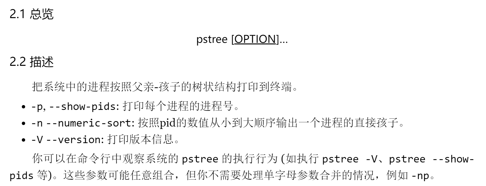
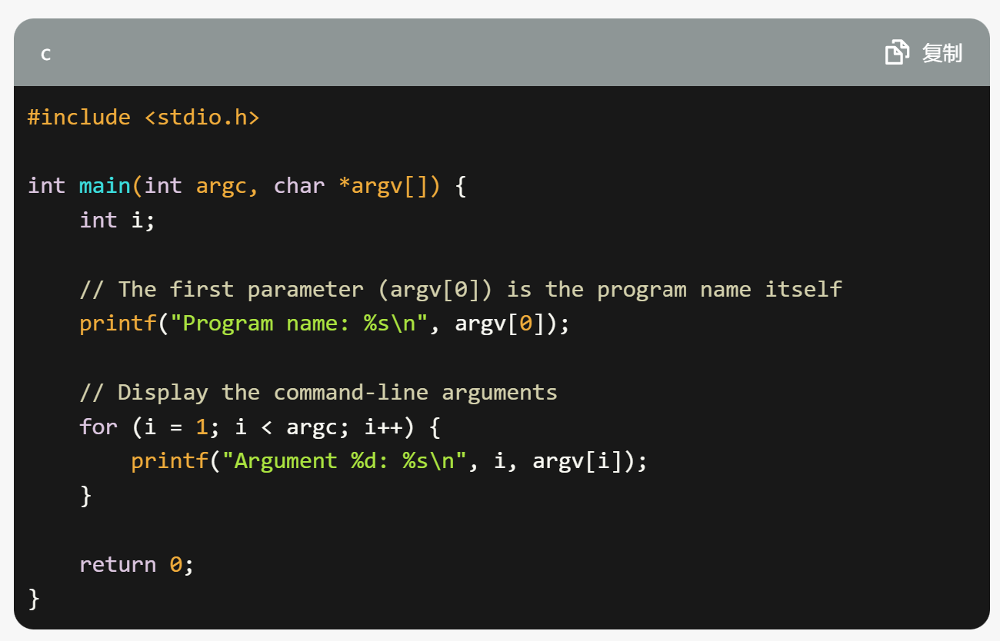

# M1: 打印进程树 (pstree)
## 实验要求
* 实现 pstree 打印进程之间的树状的父子关系。

## 解决流程
> 作为第一个要完成的作业，确实对整体的思维框架不是很了解，还不能很好的跟上老师的思路，因此这里把完整的思维过程进行梳理。

### Step1 明确问题
当拿到这个问题之后，首先要仔细的观测一下需要实现的对象 `pstree`，这里通过重定向的方式将 `pstree` 的结果输出到文件夹中，分别使用以下的命令：
* `pstree > ~/Desktop/os_learning/os_m_code/M1_print_process_tree/pstree.log`
* `pstree -n > ~/Desktop/os_learning/os_m_code/M1_print_process_tree/pstree.log`
* `pstree -p > ~/Desktop/os_learning/os_m_code/M1_print_process_tree/pstree.log`
之后再查一下 pstree 的用法，同样使用 Linux 自带的命令：
* `man pstree > ~/Desktop/os_learning/os_m_code/M1_print_process_tree/pstree_man.txt`

### Step2 问题拆解
下面是参考课程指南中给出的问题拆解方法：
* 得到命令行的参数，根据要求设置标志变量的数值
* 得到系统中所有进程的编号 (每个进程都会有唯一的编号) 保存到列表里
* 对列表里的每个编号，得到它的的父亲是谁
* 在内存中把树建好，按命令行参数要求排序
* 把树打印到终端上

### Step3 得到命令行的参数
* 在我们有了 ChatGPT 工具之后其实对于这种简单的问题我感觉可以直接通过 ChatGPT 得到思路，所以我对 ChatGPT 做了如下的操作：

* ChatGPT 也给了我一个代码：

* 为了验证这个代码的正确性，我就需要在 Linux 中尝试一下。

### Step4 得到系统中所有进程的编号
* 接下来我对 ChatGPT 做了如下的操作：

* ChatGPT 也给了我一个代码：

* 不保证 ChatGPT 给出的代码一定对，但是在 ChatGPT 给出的关键词中看到了 /proc/，所以这个是一个线索，在网上找到了如下的资料：

    [How to Use /proc File System to Monitor Your Linux System](https://www.tecmint.com/exploring-proc-file-system-in-linux/)

    [proc(5) — Linux manual page](https://man7.org/linux/man-pages/man5/procfs.5.html)

* 于是就可以知道 /proc/ 中的文件实际上就是在表示所有进程的编号，并且可以通过编号下的 status 得知进程的父子关系，这样就可以去验证一下 ChatGPT 给出的代码的正确性了。

