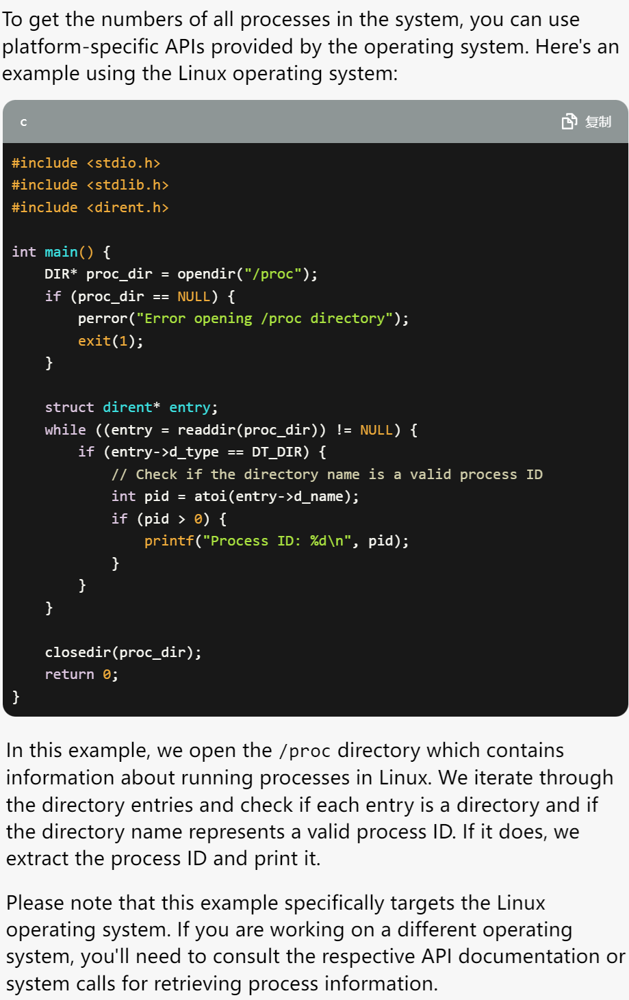

# M1: 打印进程树 (pstree)
## 实验要求
* 实现 pstree 打印进程之间的树状的父子关系，我在这个里面实现了如下两个功能：
    * `-p, --show-pids`：打印每个进程的进程号。
    * `-V, --version`：打印版本信息。 

## 解决流程
> 作为第一个要完成的作业，确实对整体的思维框架不是很了解，还不能很好的跟上老师的思路，因此这里把完整的思维过程进行梳理。

### Step1 明确问题
当拿到这个问题之后，首先要仔细的观测一下需要实现的对象 `pstree`，这里通过重定向的方式将 `pstree` 的结果输出到文件夹中，分别使用以下的命令：
* `pstree > ~/Desktop/os_learning/os_m_code/M1_print_process_tree/pstree.log`
* `pstree -p > ~/Desktop/os_learning/os_m_code/M1_print_process_tree/pstree-p.log`
之后再查一下 pstree 的用法，同样使用 Linux 自带的命令：
* `man pstree > ~/Desktop/os_learning/os_m_code/M1_print_process_tree/pstree_man.txt`

### Step2 问题拆解
下面是参考课程指南中给出的问题拆解方法：
* 得到命令行的参数，根据要求设置标志变量的数值
* 得到系统中所有进程的编号 (每个进程都会有唯一的编号) 保存到列表里
* 对列表里的每个编号，得到它的的父亲是谁
* 在内存中把树建好，按命令行参数要求排序
* 把树打印到终端上

### Step3 得到命令行的参数
* 在我们有了 ChatGPT 工具之后其实对于这种简单的问题我感觉可以直接通过 ChatGPT 得到思路，所以我对 ChatGPT 做了如下的操作：

* ChatGPT 也给了我一个代码：

* 为了验证这个代码的正确性，我就需要在 Linux 中尝试一下。

### Step4 得到系统中所有进程的编号
* 接下来我对 ChatGPT 做了如下的操作：

* ChatGPT 也给了我一个代码：

* 不保证 ChatGPT 给出的代码一定对，但是在 ChatGPT 给出的关键词中看到了 /proc/，所以这个是一个线索，在网上找到了如下的资料：

    [How to Use /proc File System to Monitor Your Linux System](https://www.tecmint.com/exploring-proc-file-system-in-linux/)

    [proc(5) — Linux manual page](https://man7.org/linux/man-pages/man5/procfs.5.html)

* 于是就可以知道 /proc/ 中的文件实际上就是在表示所有进程的编号，并且可以通过编号下的 status 得知进程的一些参量，通过 `cat /proc/PID/status` 可以打印出来，这样就可以去验证一下 ChatGPT 给出的代码的正确性了。
* 观察打印出来的结果可以得到如下几个参数，在 proc(5) — Linux manual page 这里可以找到如下几个参数的含义。
    ```
    Tgid   Thread group ID (i.e., Process ID).
    Ngid   NUMA group ID (0 if none; since Linux 3.13).
    Pid    Thread ID (see gettid(2)).
    PPid   PID of parent process
    ```
* **综上所述**：我们需要查找的 ID 应该在 `/proc/` 里面，同时可以通过 `/proc/PID/status` 查看 ID 对应的名称以及父子关系，`PPid` 应当为父，`Pid` 应当为子。

* `ls -l  | grep "^[0-9]*" | wc -l` 通过这个命令可以得到文件夹下以数字开头的文件的个数，也就是进程的个数。

### Step5 通过进程编号建树
* 这个其实是一个简单的算法问题，需要建立的是一个多叉树，所以选择如下的数据结构：
    ```C++
    // 定义树的节点
    struct Process_node {
    int pid;
    vector<Process_node*> child_node_list;
    };
    ```
* 之后通过队列的方式对树中的节点进行遍历添加，完成树的构建。

### Step6 通过树完成打印
* 实际上这个打印过程可以理解成一个回溯问题，当开始以一个树的分支进行遍历的过程中，可以维护一个 `string & printf_string` 的字符串，每次回溯前先将该次需要打印的 pid 以字符串形式扩展添加到 `printf_string` 后面，并在完成本次打印后删去这部分的字符串。大致的框架如下：
    ```C++
    printf_string 字符串添加;
        
    for()
    {
        // 递归调用
        printf_pid_tree(...);
    }

    printf_string 字符串截取;
    ```

## 资料
* [How do I view the value of an \<optimized out\> variable in C++](https://stackoverflow.com/questions/9123676/how-do-i-view-the-value-of-an-optimized-out-variable-in-c)
* [Concatenate path with filename in C](https://stackoverflow.com/questions/41749891/concatenate-path-with-filename-in-c)
* [How to print a null-terminated string with newlines without showing backslash escapes in gdb?](https://stackoverflow.com/questions/1530736/how-to-print-a-null-terminated-string-with-newlines-without-showing-backslash-es)
* [Removing trailing newline character from fgets() Input](https://www.geeksforgeeks.org/removing-trailing-newline-character-from-fgets-input/)
* [打印STL容器中的内容](https://www.kancloud.cn/wizardforcel/gdb-tips-100/146748)
* [How to Use /proc File System to Monitor Your Linux System](https://www.tecmint.com/exploring-proc-file-system-in-linux/)

* [proc(5) — Linux manual page](https://man7.org/linux/man-pages/man5/procfs.5.html)


