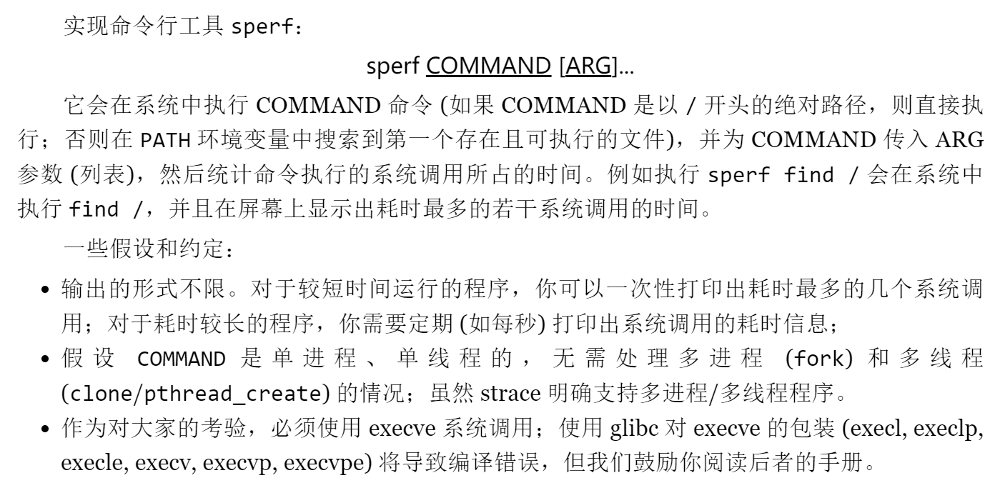

# M3: 系统调用 Profiler (sperf)
## 实验要求


## 解决流程
### Step1：步骤拆解
* 根据 JYY 老师的文档说明，需要从以下三个步骤出发进行程序的分析与编写：

    * 创建子进程，在子进程中启动 strace (通过 fork/execve 系统调用)。
    * 在父进程中捕获 strace 的输出 (通过 pipe 系统调用)。
    * 解析捕获的 strace 输出，并把系统调用的时间信息统计显示。

### Step2：分析 strace
> 这次的实现核心依赖的是 Linux 中的 strace 函数，因此这里首先对 strace 函数进行分析。


* 根据下面的资料可以得到 strace 的基本用法 `strace cmd` 以及显示系统调用的时间的选项 `-T`，[Linux 中的 Strace 命令及示例](https://www.geeksforgeeks.org/strace-command-in-linux-with-examples/) 。

### Step3：设计 sperf
> 这里也是对 JYY 老师的文档进行一个摘录。

* 解析输入的 `sperf` 后面跟着的 COMMAND 以及 ARG。
* 使用 `fork` 创建一个新的进程：
    * 子进程使用 execve 调用 strace COMMAND ARG，启动一份 strace。
    * 在 execve 成功返回以后，子进程已经不再受控制了，strace 会不断输出系统调用的 trace，直到程序结束。程序不结束 strace 也不会结束。
* 父进程想办法不断读取 strace 的输出，直到 strace 程序结束。
    * 解析出读取到输出对应的每个系统调用的时间，从而把统计信息打印到屏幕上。

### Step4：使用 execve 创建子进程

* 根据下面的资料可以得到 `execve` 函数的用法：[linux中execve函数的用法](https://www.cnblogs.com/jxhd1/p/6706701.html)

`int execve(const char *filename, char *const argv[], char *const envp[]);`
* 课程文档中给出了一段代码：
```C
#include <stdio.h>
#include <stdlib.h>
#include <unistd.h>

int main(int argc, char *argv[]) {
  char *exec_argv[] = { "strace", "ls", NULL, };
  char *exec_envp[] = { "PATH=/bin", NULL, };
  // 下面这行代码使用 execve 是无法执行的
  // 会出现 ./sperf-64: No such file or directory 的问题
  // 但是使用 execvpe 可以执行
  execve("strace",          exec_argv, exec_envp);
  
  execve("/bin/strace",     exec_argv, exec_envp);
  execve("/usr/bin/strace", exec_argv, exec_envp);
  perror(argv[0]);
  exit(EXIT_FAILURE);
}

```


* `execvpe` 的使用存在一个小问题，使用 make 会报错找不到 execvpe，需要使用 gcc 直接进行编译， [问答](https://stackoverflow.com/questions/31106601/attempting-to-use-execvpe-but-get-implicit-declaration-error-even-though)  。

### Step5：使用 pipe 在父子进程之间传递数据
* 资料可以参考这个：[Linux下进程间通信方式——pipe（管道）](https://www.cnblogs.com/wuyepeng/p/9747557.html)
* 基本流程：
    * 父进程创建管道，得到两个件描述符指向管道的两端。
    * 父进程 fork 出子进程，子进程也有两个文件描述符指向同管道。
    * 父进程关闭 fd[0], 子进程关闭 fd[1]，即子进程关闭管道读端, 父进程关闭管道写端（因为管道只支持单向通信）。子进程可以往管道中写, 父进程可以从管道中读, 管道是由环形队列实现的, 数据从写端流入从读端流出,这样就实现了进程间通信。
* 关注文件描述符的操作
    * 子进程部分：首先需要关闭子进程的读部分，之后将 strace 的输出重定向到子进程的写部分，之后将标准输出重定向到 null，丢弃 strace 调用函数本身的输出。
        ```c
        // 关闭子进程的读部分
        close(fildes[0]);
        // 将 strace 的输出重定向到子进程的写部分
        dup2(fildes[1], STDERR_FILENO);
        // 丢弃 strace 调用的函数本身的输出
        int nullfd = open("/dev/null", O_WRONLY); 
        dup2(nullfd, STDOUT_FILENO);
        ```
    * 父进程部分：首先需要关闭父进程的写部分，之后将父进程的读部分重定向到标准输入，之后可以使用 `fgets` 按行读取。
        ```c
        // 关闭父进程的写部分
        close(fildes[1]);

        char buf[MAX_LINE];
        dup2(fildes[0], STDIN_FILENO);
        ```
### Step6：解析 strace 的输出
* 这部分直接使用正则表达式即可完成，可以通过该 ChatGPT 直接设计所需要的正则表达式的格式。

### 结果
* 程序正常输出每一个命令及其对应的时间占比。
    ```c
    /*-------- Command Time Cost --------*/
    0:fcntl 26.8%
    1:close 23.0%
    2:getdents64 16.7%
    3:newfstatat 15.4%
    4:openat 9.1%
    /*-------- Command Time Cost --------*/
    0:fcntl 25.5%
    1:close 21.9%
    2:getdents64 19.0%
    3:newfstatat 15.6%
    4:openat 9.4%
    /*-------- Command Time Cost --------*/
    0:fcntl 24.4%
    1:getdents64 22.5%
    2:close 21.0%
    3:newfstatat 14.7%
    4:openat 9.0%
    /*-------- Command Time Cost --------*/
    0:getdents64 24.3%
    1:fcntl 24.0%
    2:close 20.6%
    3:newfstatat 14.2%
    4:openat 8.7%
    /*-------- Command Time Cost --------*/
    0:getdents64 24.3%
    1:fcntl 24.2%
    2:close 20.8%
    3:newfstatat 14.1%
    4:openat 8.7%
    /*-------- Command Time Cost --------*/
    0:getdents64 25.2%
    1:fcntl 24.0%
    2:close 20.7%
    3:newfstatat 13.9%
    4:openat 8.6%
    ```
## 总结
* 实现 sperf 主要体验了 fork，execve 以及进程间通信 pipe 的基本用法，比较深入的了解了进程通信的基本思想。

## 资料
* [Linux 中的 Strace 命令及示例](https://www.geeksforgeeks.org/strace-command-in-linux-with-examples/)
* [linux中execve函数的用法](https://www.cnblogs.com/jxhd1/p/6706701.html)
*  [问答](https://stackoverflow.com/questions/31106601/attempting-to-use-execvpe-but-get-implicit-declaration-error-even-though) 
* [Linux下进程间通信方式——pipe（管道）](https://www.cnblogs.com/wuyepeng/p/9747557.html)


