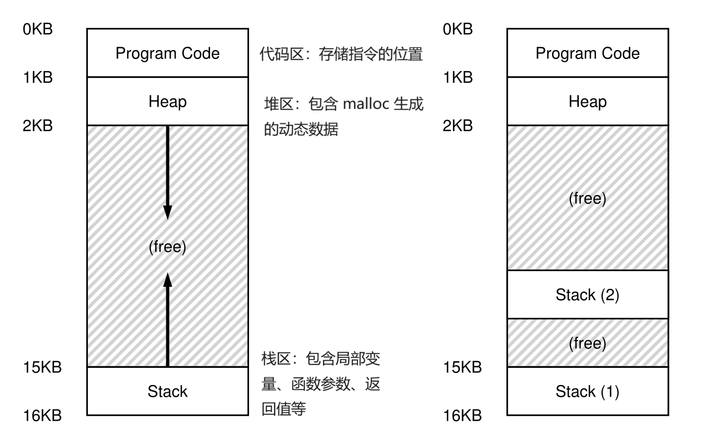

# L2 并发性

## 基本概念
### 线程
* 线程：每个线程都有一个程序计数器（PC）来跟踪程序获取指令的位置以及自己独立的寄存器用于计算。因此，如果在单个处理器上同时运行两个线程，当处理器从线程（T1）切换到另一个线程（T2）时，必须进行上下文切换。在运行 T2 之前必须保存 T1 寄存器的状态并恢复 T2 寄存器状态，从这个角度来看线程与进程是十分相似的。但是 **线程共享地址空间**，因此在切换过程中不需要切换正在使用的页表。下面的图中，左边是单线程，右边是多线程，堆栈分配的变量、参数、返回值等被放在对应线程的堆栈中：

<p align="center">
  
</p>

### 使用多线程的原因？
* Reason 1：将任务并行处理，加速运算。
* Reason 2：避免相较于 CPU 慢得多的 I/O 操作阻塞程序运行。当程序中的一个线程阻塞等待 I/O 时，CPU调度器可以切换到其他线程运行。

上面的情况也可以使用多进程而不是多线程，但是对于需要共享数据的任务来说，多线程可以共享一个地址空间，使共享数据变得容易。对于逻辑上独立的任务来说，它们很少需要共享内存中的数据结构，因此进程是一个更合理的选择。

### 多线程带来的麻烦
* 例子：在下面的程序中两个线程同时增加 counter 的计数结果，多次运行可以得到最终 counter 的值为 19345221、19221041 等，值不稳定，且大部分情况下不等于 20000000。
    ```c
    static volatile int counter = 0;

    // 每次给 counter 加一
    void *mythread(void *arg) 
    {
        int i;
        for (i = 0; i < 1e7; i++)
            counter = counter + 1;
        return NULL;
    }

    // 同时运行两个线程
    int main(int argc, char *argv[]) 
    {
        pthread_t p1, p2;
        printf("main: begin (counter = %d)\n", counter);
        Pthread_create(&p1, NULL, mythread, "A");
        Pthread_create(&p2, NULL, mythread, "B");

        // 等待两个线程运行结束
        Pthread_join(p1, NULL);
        Pthread_join(p2, NULL);
        printf("main: done with both (counter = %d)\n",counter);
        return 0;
    }
    
    ```
* 对上面的代码进行反汇编可以得到 `counter = counter + 1` 部分对应的代码为：
    ```asm
    mov 0x8049a1c, %eax
    add $0x1, %eax
    mov %eax, 0x8049a1c
    ```
    counter 位于地址 0x8049a1c。在实现加法的过程中，首先使用 `mov` 指令获取地址处的内存值，并将其放入寄存器 `eax` 中。然后，执行 `add` 操作，给 `eax` 寄存器加 1。最后，将 `eax` 的内容存储回相同地址的内存中。

    如果 Thread1 刚运行完 `add $0x1, %eax` 后被切换，换 Thread2 来运行，由于 Thread1 并没有将计算结束的寄存器值写回内存中，Thread2 拿到的寄存器的值就是原来的，再加一后写回寄存器，Thread2 执行结束，再换回 Thread1，Thread1 直接往内存里写入自己寄存器里面的值，相当于覆盖了 Thread2 刚写入内存的值，而不是完成了两次加法，这就出现了问题。

* 根源：线程的调度是不受控制的。线程是并发运行的，因此如果有两个线程 Thread1 以及 Thread2 时，我们不知道会先运行 Thread1 还是 Thread2，也不知道会不会在运行 Thread1 运行到一半之后被切换出去转而运行 Thread2。更严谨的来说，执行此代码的多个线程可能导致竞争，因此我们将此段代码称为临界区 (critical section)。临界区是访问共享变量（或者更一般地说，共享资源）的一段代码，不能由多个线程并发执行。

**我们需要代码是互斥的，也就是说如果一个线程在临界区内执行，其他线程将被阻止，这样保证计算结果的确定性。** 

* 解决上述问题的方法很简单，就是保证 `counter = counter + 1` 是原子的（atomicity），中间不会被打断的，因此之后会讲到同步原语（synchronization primitives）。

### 多线程需要解决的问题
* Problem1：对于临界区问题，保证互斥性，锁会被用来解决这个问题。
* Problem2：线程之间的等待问题，比如 Thread1 必须等 Thread2 结束之后才能运行，当程序执行 I/O 磁盘交互的过程中，程序处于睡眠状态，当 I/O 结束后需要将程序从休眠状态中唤醒，以便继续运行，条件变量会被用来解决这个问题。

## 锁
### 锁的基本概念
* 锁实际上就是通过一个变量锁住临界区，保证同一时刻仅能有一个线程进入临界区，本质就是实现临界区一段代码整体的原子化。
    ```c
    lock_t mutex;
    ...
    lock(&mutex);
    balance = balance + 1;
    unlock(&mutex);
    ```
> 锁为程序员提供了对调度的最小控制。一般情况下，我们将线程视为由程序员创建但由操作系统调度的实体。锁将部分控制权交还给程序员，通过给一段代码加上锁，程序员可以保证在这段代码中活动的线程不超过一个。因此，锁有助于将传统操作系统调度中相对混乱的流程转变为更受控制的活动。
### 锁的实现
#### 锁的要求
* Require 1：要实现基本功能——提供互斥性。
* Require 2：要保证一定的公平性，尽量减少线程的饥饿现象。
* Require 3：要保证性能，特别是使用锁所增加的时间开销。
    * 当一个运行中的线程获取和释放锁时带来的开销。
    * 单一 CPU 的情况下，多个线程征用同一个锁时的性能问题。
    * 多个 CPU 的情况下，每个 CPU 上的线程都争用锁时，锁的执行情况。
#### Method 1：控制中断
* 在进入临界区之前关闭中断(使用某种特殊的硬件指令)，从而确保临界区内的代码不会被中断，进而实现原子性。当临界区的代码执行结束后，我们重新启用中断(同样，通过硬件指令)，程序照常进行。逻辑代码如下所示：
    ```c
    void lock() 
    {
        DisableInterrupts();
    }
    void unlock() 
    {
        EnableInterrupts();
    }
    ```

* 优点
    * 简单  
* 缺点
    * 每个线程都能自己开关中断，相当于给每个应用程序以内核权限了，较为危险。
    * 多处理时无法使用。因为仅能关闭单个处理器的中断，其它的处理器上的线程还是可能同步进入临界区。
    * 可能导致中断丢失，比如在 CPU 中断被关掉的过程中，磁盘设备来了一个读请求中断，这个中断就会被丢失。
#### Method 2：自旋锁 (短临界区)
（1）TestAndSet 构建自旋锁：
* TestAndSet 的代码如下所示：
    ```c
    // 返回旧值，同时将旧值更新为新值
    int TestAndSet(int *old_ptr, int new) 
    {
        int old = *old_ptr;
        *old_ptr = new;
        return old;
    }
    ```
* 利用上面给出的代码可以实现自旋锁：
    ```c
    typedef struct __lock_t 
    {
        int flag;
    } lock_t;

    void init(lock_t *lock) 
    {
        // 0: 锁可用, 1: 锁以及被持有
        lock->flag = 0;
    }

    void lock(lock_t *lock) 
    {
        // 自旋等待
        while (TestAndSet(&lock->flag, 1) == 1);
    }

    void unlock(lock_t *lock) 
    {
        lock->flag = 0;
    }
    ```

    * 当前没有其它线程持有锁的时候，一个线程调用 `lock()`，flag 应该是 0。当线程调用 `TestAndSet(flag, 1)` 时，将返回 0，因此，该调用线程将获得锁，并且将该值设置为 1，从而表示锁现在已被持有。当线程结束其临界区代码的执行后，它调用 `unlock()` 将标志设置为零。
    * 在一个线程已经持有锁的情况下，这个线程将调用 `lock()`，然后调用 `TestAndSet(flag, 1)`，该函数将返回标志处的旧值 1 (因为锁被持有)，同时再次将其设置为 1。只要锁被另一个线程持有，该函数就会反复返回1，因此这个线程会一直旋转，直到锁最终被释放。当其他线程最终将该标志设置为 0 时，该线程再次调用 `TestAndSet()`，返回 0，同时自动将值设置为 1，从而获得锁并进入临界区。

* 在 X86 上，可以使用如下的代码实现的该功能，调用汇编的原子指令 `xchg`：
    ```c
    int xchg(volatile int *addr, int newval) 
    {
        int result;
        asm volatile ("lock xchg %0, %1"
            : "+m"(*addr), "=a"(result) : "1"(newval));
        return result;
    }
    ```

（2）Load-Linked 和 Store-Conditional 构建自旋锁：
* MIPS、ARM 以及 RISC-V 上都是使用类似的方法构建的自旋锁。
* Load-Linked 以及 Store-Conditional 的实现用 C 语言代码可表示如下所示：
    ```c
    int LoadLinked(int *ptr) 
    {
        return *ptr;
    }

    int StoreConditional(int *ptr, int value) 
    {
        if (自从对 addr 这个内存调用 LL 函数之后，*ptr 没有被更新过) 
        {
            *ptr = value;
            return 1; // 成功
        } 
        else 
        {
            return 0; // 失败
        }
    }
    ```
* LL 的作用只是从内存中获取一个值并将其放入寄存器中。
* SC 指令，它只有在没有对相应地址上的值更新过的情况时才能调用成功。如果成功，SC 返回 1 并将 ptr 处的值更新为 value ; 如果失败，则不更新 ptr 处的值并返回 0。
* 由此构建的锁如下所示：
    ```c
    void lock(lock_t *lock) 
    {
        while (1) 
        {
            while (LoadLinked(&lock->flag) == 1)
            ; // 自旋
            if (StoreConditional(&lock->flag, 1) == 1)
                return; // 如果设置为 1 则成功
            // 否则：重试
        }
    }

    void unlock(lock_t *lock) 
    {
        lock->flag = 0;
    }
    ```
* 这里需要注意一点：一个线程调用 `lock()` 并执行 LL 指令后，当锁未被持有时返回0。在它进行 SC 之前，被中断，另一个线程进入锁代码，也执行 LL指令。两个线程现在都可以进到 SC 指令执行的前一刻，但是这些线程中只有一个能成功地将标志更新为 1，从而获得锁，第二个尝试 SC 的线程将失败，所以还是保证了互斥性。

* 在 RISC-V 上，可以使用如下的代码实现的该功能：
    * LR: 在内存上标记 reserved，中断、其他处理器写入都会导致标记消除。
    ```c
    lr.w rd, (rs1)

    rd = M[rs1]
    reserve M[rs1]
    ```
    * SC：如果标记未被解除，则写入。
    ```c
    sc.w rd, rs2, (rs1)
    
    if still reserved:
        M[rs1] = rs2
        rd = 0
    else:
        rd = nonzero
    ```

* 缺点
    * 除了进入临界区的线程，其他处理器上的线程都在空转。
    * 获得自旋锁的线程可能被操作系统切换出去，操作系统不 “感知” 线程在做什么。

* 自旋锁的使用场景：操作系统内核的并发数据结构。
    * 临界区几乎不 “拥堵”。
    * 持有自旋锁时禁止执行流切换。

#### Method 3：互斥锁（长临界区）
* 引入操作系统进行调度：
    * `syscall(SYSCALL_lock, &lk)` 试图获得 lk，但如果失败，就切换到其他线程。
    * `syscall(SYSCALL_unlock, &lk)` 释放 lk，如果有等待锁的线程就唤醒。
#### 自旋锁与互斥锁比较
* 自旋锁 (线程直接共享 locked)
    * 更快的 fast path：`xchg` 成功 → 立即进入临界区，开销很小。
    * 更慢的 slow path：`xchg` 失败 → 浪费 CPU 自旋等待。
* 互斥锁 (通过系统调用访问 locked)
    * 更快的 slow path：上锁失败线程不再占用 CPU。
    * 更慢的 fast path：即便上锁成功也需要进出内核 (syscall)。
#### Linux 中锁的实现
* 用 `mutex_lock` 实现了上锁。其中使用一个 32bit 的数 `mutex` 来设置锁的状态以及锁的数量，如果最高位为 1 则表示上锁了。
```c
void mutex_lock (int *mutex) 
{
    int v;
    // 清除 mutex 的第 31 位，我们就可以得到锁（fastpath）
    if (atomic_bit_test_set (mutex, 31) == 0)
        return;
    atomic_increment (mutex);
    while (1) 
    {
        if (atomic_bit_test_set (mutex, 31) == 0) 
        {
            atomic_decrement (mutex);
            return;
        }
        // 确定 mutex 的值是否为负数（最高位是否为 1）
        v = *mutex;
        if (v >= 0)
            continue;
        futex_wait (mutex, v);
    }
 }
```
* 用 `mutex_unlock` 实现了解锁。
```c
 void mutex_unlock (int *mutex) 
 {
    // 只有当 mutex 最高位为 1（还未解锁），且剩下位为 0 时（但是已经没有需要锁的线程了），结果才为 0
    if (atomic_add_zero (mutex, 0x80000000))
        return;

    // 如果有需要锁的线程，就唤醒
    futex_wake (mutex);
 }
```
* 这个里面综合了自旋锁以及互斥锁的优点，在 Fast path 部分使用一条原子指令，上锁成功立即返回，不需要进行系统调用，在 Slow path 部分，如果上锁失败，执行系统调用让线程休眠。


## 条件变量

### 条件变量的定义
* 线程可以使用条件变量来等待一个条件被满足，当状态不满足时将自己加入队列等待该条件，别的线程如果改变了上述状态就可以唤醒一个或多个等待线程，让它们继续执行。

    ```c
    int done = 0;
    pthread_mutex_t m = PTHREAD_MUTEX_INITIALIZER;
    pthread_cond_t c = PTHREAD_COND_INITIALIZER;

    void thr_exit() 
    {
        Pthread_mutex_lock(&m);
        done = 1;
        Pthread_cond_signal(&c);
        Pthread_mutex_unlock(&m);
    }

    void *child(void *arg) 
    {
        printf("child\n");
        thr_exit();
        return NULL;
    }

    void thr_join() 
    {
        Pthread_mutex_lock(&m);
        while (done == 0)
            // wait 里面其实也有锁，当该线程被切换出去休眠的
            // 时候这个锁就要被释放，当再次被唤醒回来的时候要重新
            // 拿到这把锁
            Pthread_cond_wait(&c, &m);
        Pthread_mutex_unlock(&m);
    }

    int main(int argc, char *argv[]) 
    {
        printf("parent: begin\n");
        pthread_t p;
        Pthread_create(&p, NULL, child, NULL);
        thr_join();
        printf("parent: end\n");
        return 0;
    }
    ```
* 上面的代码中就使用条件变量实现了 parent -> child 的顺序执行。

### 生产者/消费者（有界缓冲区）问题
* 定义：有一个或多个生产者线程以及一个或多个消费者线程，生产者将生成的数据项放入缓冲区，消费者从缓冲区取走数据项，以某种形式消费掉。

#### 单值缓冲区
* 生成者与消费者的函数代码如下：
    ```c
    int buffer;
    int count = 0; // 初始化 count

    // 充当生产者
    void put(int value) 
    {
        count = 1;
        buffer = value;
    }

    // 充当消费者
    int get() 
    {
        count = 0;
        return buffer;
    }

    ```
* 生产者与消费者问题的解法：
    ```c
    cond_t empty, fill;
    mutex_t mutex;

    void *producer(void *arg) 
    {
        int i;
        for (i = 0; i < loops; i++) 
        {
            Pthread_mutex_lock(&mutex);
            while (count == 1) // ERR1: if (count == 1)
                Pthread_cond_wait(&empty, &mutex); // ERR2: Pthread_cond_wait(&cond, &mutex);
            put(i);
            Pthread_cond_signal(&fill); // ERR2: Pthread_cond_signal(&cond);
            Pthread_mutex_unlock(&mutex);
        }
    }

    void *consumer(void *arg) 
    {
        int i;
        for (i = 0; i < loops; i++) 
        {
            Pthread_mutex_lock(&mutex);
            while (count == 0) // ERR1: if (count == 0)
                Pthread_cond_wait(&fill, &mutex); // ERR2: Pthread_cond_wait(&cond, &mutex);
            int tmp = get();
            Pthread_cond_signal(&empty); // ERR2: Pthread_cond_signal(&cond);
            Pthread_mutex_unlock(&mutex);
            printf("%d\n", tmp);
        }
    }
    ```
* 注意在上面的解法中有两种错误的尝试：
  * ERR1：在第一种错误中，**使用的是 if 而不是 while**。这会导致如下的问题，假设有一个生产者线程 P1，以及两个消费者线程 C1、C2。C1 先开始执行，执行到 if 这里因为条件不满足，C1 休眠去了，之后 P1 开始执行，P1 正常执行完成后 count 为 1，且唤醒 C1（C1 被唤醒后在等待队列，并未立刻执行），此时 C2 恰好先执行了，因为 count 已经是 1 了，因此 C2 正常执行结束，等 C2 执行结束后，C1 从等待队列出来继续执行，但是因为是 if 所以不会再次检测 count 的值，C1 执行到 get() 这步发生了错误。
  * ERR2：在第二种错误中，**条件变量仅使用了一种 cond**。这会导致如下的问题，假设有一个生产者线程 P1，以及两个消费者线程 C1、C2。C1 与 C2 都先开始执行，因为不满足条件所以都休眠了，之后 P1 开始执行，并将 count 转换为 1，执行完成后唤醒 C1，之后 P1 进入休眠。C1 正常执行，将 count 转换为 0 并进入休眠，在进入休眠前唤醒了线程 C2（本来应该唤醒 P1，但是因为条件变量一样所以不确定到底唤醒了谁），C2 发现 count 是 0 所以也进入休眠，现在三个线程都休眠了，程序卡死。 

#### 多值缓冲区
* 增加了多个缓冲区的槽位，这样在睡眠之前可以产生多个值，同样在睡眠之前也可以消费多个值，从而减少上下文切换的次数，提高效率。
```c
int buffer[MAX];
int fill_ptr = 0;
int use_ptr = 0;
int count = 0;

void put(int value) 
{
    buffer[fill_ptr] = value;
    fill_ptr = (fill_ptr + 1) % MAX;
    count++;
}

int get() 
{
    int tmp = buffer[use_ptr];
    use_ptr = (use_ptr + 1) % MAX;
    count--;
    return tmp;
}


cond_t empty, fill;
mutex_t mutex;

void *producer(void *arg) 
{
    int i;
    for (i = 0; i < loops; i++) 
    {
        Pthread_mutex_lock(&mutex); 
        while (count == MAX)
            Pthread_cond_wait(&empty, &mutex); 
        put(i); 
        Pthread_cond_signal(&fill); 
        Pthread_mutex_unlock(&mutex);
    }
}

void *consumer(void *arg) 
{
    int i;
    for (i = 0; i < loops; i++) 
    {
        Pthread_mutex_lock(&mutex);
        while (count == 0)
            Pthread_cond_wait(&fill, &mutex);
        int tmp = get();
        Pthread_cond_signal(&empty);
        Pthread_mutex_unlock(&mutex);
        printf("%d\n", tmp);
    }
}
```
#### 覆盖条件
* 本质是在解决不知道该唤醒哪个线程这样一个问题，假设目前没有空闲内存，T1 调用 `allocate(100)`，T2 调用 `allocate(10)`，两者因为条件均不满足因此都进入休眠，假设第三个线程 T3 调用了 `allocate(50)`，如果它唤醒了 T1 ，因为 T1 需要的内存不够，因此还会进入休眠状态，程序卡死。
    ```c
    // 堆区的最大大小
    int bytesLeft = MAX_HEAP_SIZE;

    // 锁与条件变量
    cond_t c;
    mutex_t m;

    // 申请内存
    void *allocate(int size) 
    {
        Pthread_mutex_lock(&m);
        while (bytesLeft < size)
            Pthread_cond_wait(&c, &m);
        void *ptr = ...; // 从堆区开辟内存
        bytesLeft -= size;
        Pthread_mutex_unlock(&m);
        return ptr;
    }

    // 释放内存
    void free(void *ptr, int size) 
    {
        Pthread_mutex_lock(&m);
        bytesLeft += size;
        Pthread_cond_signal(&c); // 应该提醒哪一个？
        Pthread_mutex_unlock(&m);
    }

    ```
* 解决方法也非常直接，不知道唤醒哪个就全唤醒，使用 `Pthread_cond_broadcast()` 替换 `Pthread_cond_signal()`，所有被唤醒的线程都会自己检查条件，不满足的会自己去休眠，这种条件变量叫做覆盖条件，但是这种方法因为唤醒的线程太多，所以非必要不用。
## 信号量
### 二值信号量（锁）
* 可以使用信号量来实现锁：
    ```c
    sem_t m;
    sem_init(&m, 0, 1);

    sem_wait(&m);
    // 临界区
    sem_post(&m);
    ```
### 信号量用作条件变量
* 可以使用信号量实现一个线程暂停执行，等待某一条件成立的场景：
    ```c
    sem_t s;

    void *child(void *arg) 
    {
        printf("child\n");
        sem_post(&s); // 这里的信号量表示 child 线程被完成
        return NULL;
    }

    int main(int argc, char *argv[]) 
    {
        sem_init(&s, 0, 0);
        printf("parent: begin\n");
        pthread_t c;
        Pthread_create(&c, NULL, child, NULL);
        sem_wait(&s); // 在这里等待 child 完成
        printf("parent: end\n");
        return 0;
    }
    ```
### 信号量解决生产者/消费者问题

* 下面这段代码可以正确的解决生产者/消费者问题，需要注意的是，有两种另外的写法是不正确的。
* ERR1：生产者与消费者均不加锁，即都没有带有 `mutex` 的代码。这样当有多个生产者的时候，可能多个生产者通过 `sem_wait(&empty)` 这条代码，并重复修改 `i` 处的值（`put(i)` 这段代码就位于临界区了）。
* ERR2：交换锁与 `empty` 以及 `full` 之间的位置，这样可能带来死锁的问题，比如一个消费者先运行，它拿到锁但是因为没有 `full` 信号，因此休眠了，这样生产者再去运行会因为拿不到锁而无法继续，进而导致程序卡死。
```c
void *producer(void *arg) 
{
    int i;
    for (i = 0; i < loops; i++) 
    {
        sem_wait(&empty);
        sem_wait(&mutex);
        put(i); 
        sem_post(&mutex);
        sem_post(&full); 
    }
}

void *consumer(void *arg) 
{
    int i;
    for (i = 0; i < loops; i++) 
    {
        sem_wait(&full); 
        sem_wait(&mutex);
        int tmp = get(); 
        sem_post(&mutex);
        sem_post(&empty);
        printf("%d\n", tmp);
    }
}
```

### 信号量的实现
* 使用条件变量外加锁就可以实现信号量，同时可以通过一个 `value` 的值来计数信号量的值。
```c
typedef struct __Zem_t 
{
    int value;
    pthread_cond_t cond;
    pthread_mutex_t lock;
} Zem_t;

// 只有一个线程能调用 Zem_init
void Zem_init(Zem_t *s, int value) 
{
    s->value = value;
    Cond_init(&s->cond);
    Mutex_init(&s->lock);
}

// 实现 wait
void Zem_wait(Zem_t *s) 
{
    Mutex_lock(&s->lock);
    while (s->value <= 0)
        Cond_wait(&s->cond, &s->lock);
    s->value--;
    Mutex_unlock(&s->lock);
}

// 实现 post
void Zem_post(Zem_t *s) 
{
    Mutex_lock(&s->lock);
    s->value++;
    Cond_signal(&s->cond);
    Mutex_unlock(&s->lock);
}
```