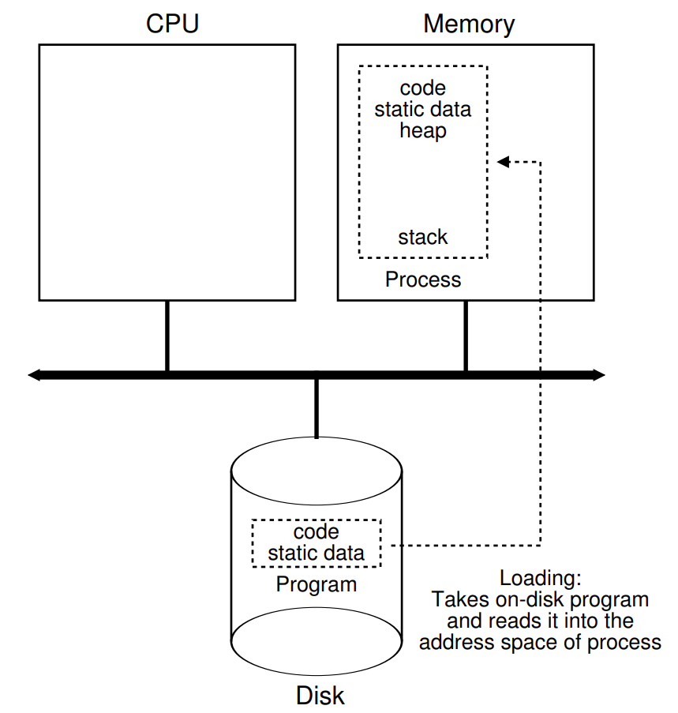
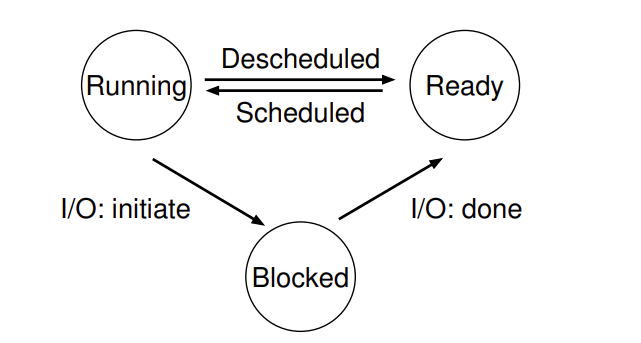
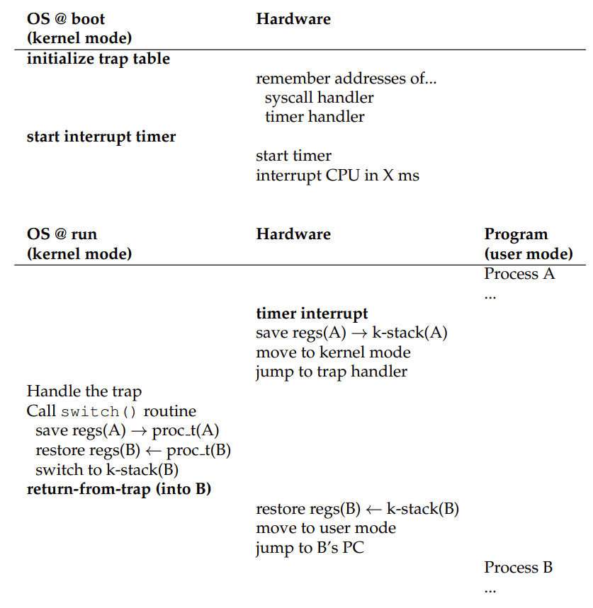
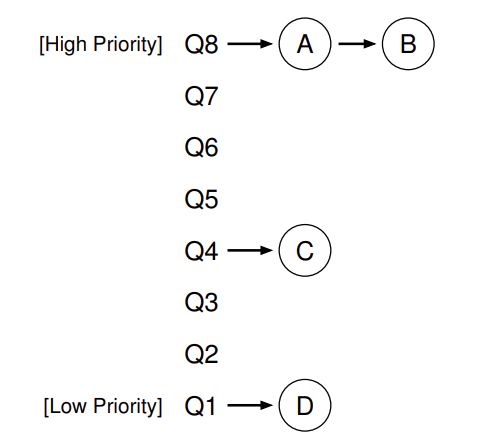
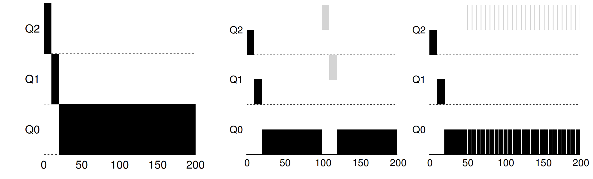
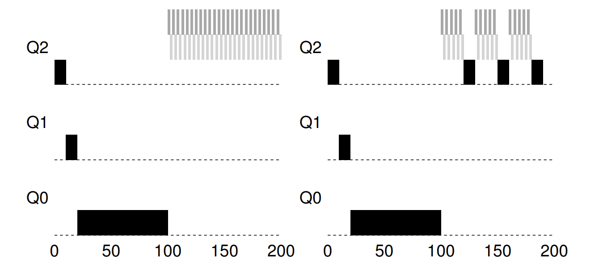
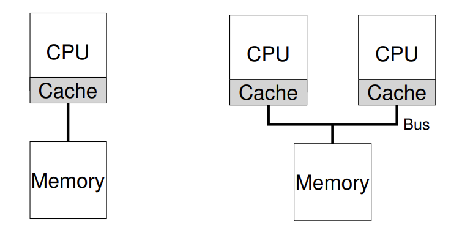
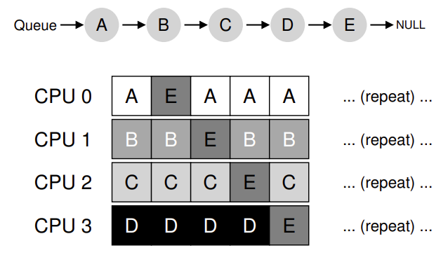
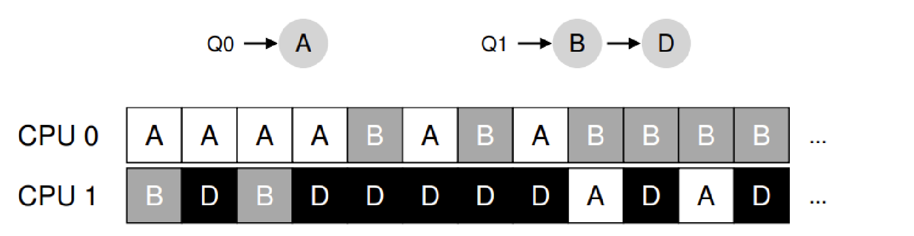

# L3 CPU 虚拟化
* 虚拟化主要分为两个部分：
    * CPU 的虚拟化（进程）。
    * 内存的虚拟化。
## 进程
### 进程的创建
<p align="center">
  
</p>

* Step1: 将代码和所有静态数据（例如初始化变量）加载（load）到内存中进程的地址空间中。
* Step2: 为 stack 分配内存，在 C 语言中栈用来存放局部变量、函数参数和返回地址。
* Step3：为 heap 堆分配内存，在 C 语言中，堆用来显式请求的动态分配数据，例如 malloc。
* Step4：执行一些其它的初始化任务，特别是与输入/输出（I/O）相关的任务，例如打开标准输入、标准输出、标准错误文件描述符。


### 进程的状态
<p align="center">
  
</p>

* 进程可以处于如上图所示的三个状态之一：
    * 运行：进程正在处理器上运行。
    * 就绪：进程准备好运行（暂时还没有运行）。
    * 阻塞：一个进程执行了某种操作，直到发生其它事件时才会准备运行，例如进程向磁盘发起 I/O 请求时，它会被阻塞，因此其它进程可以使用处理器。 

### 进程的 API
* `fork` :原来的进程（父进程）通过调用 fork 创建一个新进程（子进程），子进程不会从 main 函数开始执行，而是直接从 fork 系统调用返回，就好像它自己调用了 fork 一样。同时父进程获得的 fork 的返回值是新创建的子进程的 PID，而子进程获得的返回值是 0。
* `wait` :父进程调用 wait 等待子进程执行结束，wait 才返回父进程。
* `exec` :exec 有很多变体（具体可以参考手册）。exec 从可执行程序中加载代码和静态数据，并用这些部分覆盖自己的代码段（以及静态数据），同时初始化堆、栈以及其它内存空间，之后操作系统直接执行该程序，参数通过 argv 传递给该进程。
* 下面是对这三个 API 调用的示例：
```c
int main(int argc, char *argv[])
{
    printf("hello world (pid:%d)\n", (int) getpid());
    int rc = fork();
    if (rc < 0) 
    {
        // fork 失败的话就自动退出
        fprintf(stderr, "fork failed\n");
        exit(1);
    } 
    else if (rc == 0) 
    {
        // 子进程
        printf("hello, I am child (pid:%d)\n", (int) getpid());
        char *myargs[3];
        myargs[0] = strdup("wc");   // 程序 wc
        myargs[1] = strdup("p3.c"); // 参量 p3.c
        myargs[2] = NULL;           // 标志向量的结束
        execvp(myargs[0], myargs);  // 运行 word count 程序
        printf("this shouldn't print out");
    } 
    else 
    {
        // 父进程进入这个分支
        int wc = wait(NULL); // 等待子进程执行结束
        printf("hello, I am parent of %d (wc:%d) (pid:%d)\n",
	       rc, wc, (int) getpid());
    }
    return 0;
}
```
* **shell 的流程**: shell 是一个用户程序，它首先显示一个提示符，之后等待用户输入，当用户输入一个指令后，shell 会调用 fork 创建新进程，并调用 exec 的某个变体来执行这个可执行程序，调用 wait 等待该命令完成。子进程执行结束后，shell 从 wait 返回并再次输出一个提示符，等待用户输入下一条指令。

## 虚拟化机制（受限直接执行）
* **核心要求**: 在保持控制权的同时获得高性能。
### 受限制的操作
* 采用用户态以及内核态
    * 在用户态下运行的代码会受到限制
    * 而运行在内核模式下的代码（操作系统）可以执行任何任务
* 用户程序通过执行特殊的陷阱（trap）指令进入内核态，完成需要执行的任务后该指令返回到发起调用的用户程序中，同时将特权级别降低，回到用户态。
### 在进程之间切换
* 如何控制权交还给操作系统？ 
    * **依靠外部的时钟设备**。时钟设备编程为每隔几毫秒产生一次中断，产生中断时当前正在运行的程序停止，操作系统中预先配置的中断处理程序会运行，此时操作系统重新获得 CPU 的控制权。

### 上下文切换
* 保存当前正在运行的进程的上下文：保存通用寄存器、程序计数器以及当前正在运行的进程的内核栈指针。
* 恢复下一个要运行进程的上下文：恢复寄存器、程序计数器并切换内核栈。

通过切换栈，内核在进入切换代码调用时是一个进程（被中断的进程）的上下文，在返回时是另一进程（即将执行的进程）的上下文。当操作系统最终执行从陷阱返回指令时，即将执行的进程变成了当前运行的进程。
<p align="center">
  
</p>

```asm
# void swtch(struct context *old, struct context *new);
#
# 将当前的寄存器内容保存在 old 中，并将 new 中的内容加载到寄存器中

.globl swtch
swtch:
# 保存到 old 寄存器中
movl 4(%esp), %eax # 将 old 指针指向 eax
popl 0(%eax)       # 保存 old 的 IP
movl %esp, 4(%eax) # 和栈
movl %ebx, 8(%eax) # 以及其它寄存器
movl %ecx, 12(%eax)
movl %edx, 16(%eax)
movl %esi, 20(%eax)
movl %edi, 24(%eax)
movl %ebp, 28(%eax)

# 加载 new 到寄存器中
movl 4(%esp), %eax  # 将 new 指针指向 eax
movl 28(%eax), %ebp # 恢复其它寄存器
movl 24(%eax), %edi
movl 20(%eax), %esi
movl 16(%eax), %edx
movl 12(%eax), %ecx
movl 8(%eax), %ebx
movl 4(%eax), %esp  # 栈在这里被切换
pushl 0(%eax)       # 放置返回地址
ret                 # 最终返回新程序
```

## 进程调度
### 调度指标
* 周转时间：任务完成时间减去任务到达系统的时间，是一个性能指标。
$$ T_{周转时间} = T_{完成时间} - T_{到达时间} $$
* 响应时间：任务到达系统到首次运行的时间，是一个公平指标。
$$ T_{响应时间} = T_{首次运行} - T_{到达时间} $$
### 多级反馈队列 (Multi-level Feedback Queue, MLFQ)
* MLFQ 中有许多独立的队列，每个队列有不同的优先级，在某一个时刻观测，此时一个工作只能存在于一个队列中。
<p align="center">
  
</p>

* 调度规则：
    * 如果 A 的优先级 > B 的优先级，运行 A （不运行 B）。
    * 如果 A 的优先级 = B 的优先级，轮转运行 A 和 B。
    * 工作进入系统时，放在最高优先级（最上层队列）。
    * 一旦工作用完了其在某一层中的时间配额就降低其优先级（移入低一级队列）。
    * 经过一段时间 S, 就将系统中所有工作重新加入最高优先级队列。
* 下面是对调度规则的解释：

<p align="center">
  
</p>

* 单个长工作：如上左图所示，该工作首先进入最高优先级队列，之后每执行一个时间片就调低一级优先级直到进入最低优先级。
* 来了一个短工作：如上中图所示，到来的短工作被加入到最高优先级队列，并且在两个时间片内执行完成，之后继续运行优先级最低的长工作。
* 包含 I/O：如上右图所示，例如交互工作中的 I/O （等待用户输入输出），由于这种任务总是在时间片结束之前执行完成，因此优先级一直保持最高。

<p align="center">
  
</p>

* 考虑饥饿：左边没有优先级提升的过程，这会导致长任务被 “饿死”，右边有优先级提升的过程，可以保证每隔一段时间长任务就会被执行一次。

## 多处理器调度
<p align="center">
  
</p>

### 新的问题
* 多处理器带来的新问题：核心在于对硬件缓存（cache）的使用以及多处理器之间共享数据的方式。

* 缓存一致性
    * 问题：假设一个程序运行在 CPU1 上，当它需要从地址 A 读取数据时，由于该处的数据不在 CPU1 的缓存中，因此 CPU1 从内存中将数据读入缓存中，假设这个缓存数据为 D，之后 CPU1 修改了这个数据，这个数据在缓存中被改为 D'。此时发生中断，程序切换到 CPU2，但是 CPU2 会从内存中读入数据，该数据还是 D，发生不一致。
    * 解决：每个缓存都监听总线上所有的缓存和内存，如果 CPU 发现它在缓存中的数据有更新则会作废（或更新）该缓存中的数据。
* 同步：当多个 CPU 访问共享的数据结构时需要加锁。
* 缓存亲和度：一个进程在某个 CPU 上运行时，会加载部分数据到该 CPU 的缓存中，当该进程在相同的 CPU 上运行时，由于缓存中保存的数据会执行的比较快，但是切换到不同的 CPU 上就需要重新加载这些数据而导致比较慢。

### 调度方法
* 单队列调度：将所有需要调度的工作放入一个单独的队列中。
    * 需要从同一个队列中读入任务，因此存在同步的问题。
    * 任务在不同 CPU 上切换，因此存在缓存亲和度的问题。
<p align="center">
  
</p>
* 多队列调度：每个 CPU 一个队列。下面的这张图实现了迁移（用来实现负载均衡），队列 Q0 中只有一个任务，而 Q1 中有两个，这样 Q0 中的 A 可能占用的 CPU 时间比较长，因此考虑将 B 迁移到 Q0 中去。
<p align="center">
  
</p>
