# L3 内存虚拟化
* 虚拟化主要分为两个部分：
    * CPU 的虚拟化（进程）。
    * 内存的虚拟化。

[TOC]

## 地址空间
* 地址空间：对物理内存的抽象。
<p align="center">
  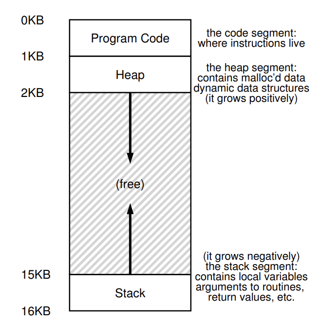
</p>

* 一个进程的地址空间包含运行程序的所有内存状态
    * 程序的代码。
    * 栈（stack）：保存当前的函数调用信息，分配空间给局部变量，传递参数和返回值，在高地址空间，由高地址向低地址变化。
    * 堆（heap）：管理动态分配的用户内存，在低地址空间，由低地址向高地址变化。

## 地址转换

### 动态重定位
* 使用基址（base）寄存器和界限（bound）寄存器。
    * 基址寄存器：用来确定物理地址 `physical address = virtual address + base`
    * 界限寄存器：提供访问保护，进程访问超过这个界限或者为负数的虚拟地址时 CPU 会触发异常。
    <p align="center">
    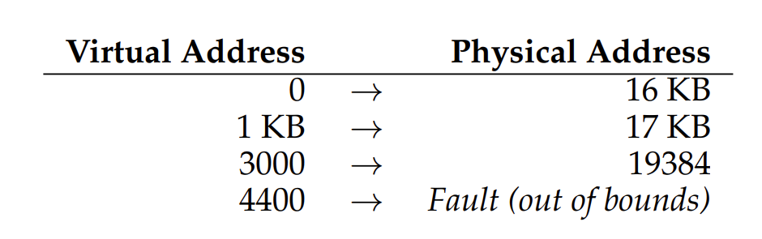
    </p>

> 我们将 CPU 的这个负责地址转换的部分统称为内存管理单元（Memory Management Unit，MMU）。

* 问题：效率较低，如下图所示，重定位的进程使用了从 32KB 到 48KB 的物理内存，但由于该进程的栈区和堆区并不很大，导致了大量的内部碎片。
> 内部碎片：在已经分配的内存单元内部有未使用的空间。

<p align="center">
  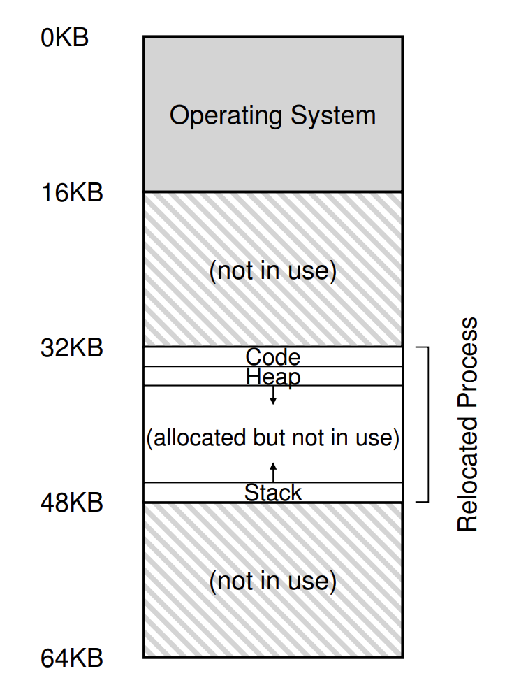
</p>

### 分段
#### 分段的基本概念
* 在 MMU 中给每个地址空间内的逻辑段一对基址和界限寄存器对，一个段只对应地址空间里的一个连续定长的区域，典型的地址空间可分为代码、栈和堆段。
* 分段机制使得操作系统能够将不同的段放到不同的物理内存区域，从而避免了虚拟地址空间中栈与堆之间的内部碎片问题。

<p align="center">
  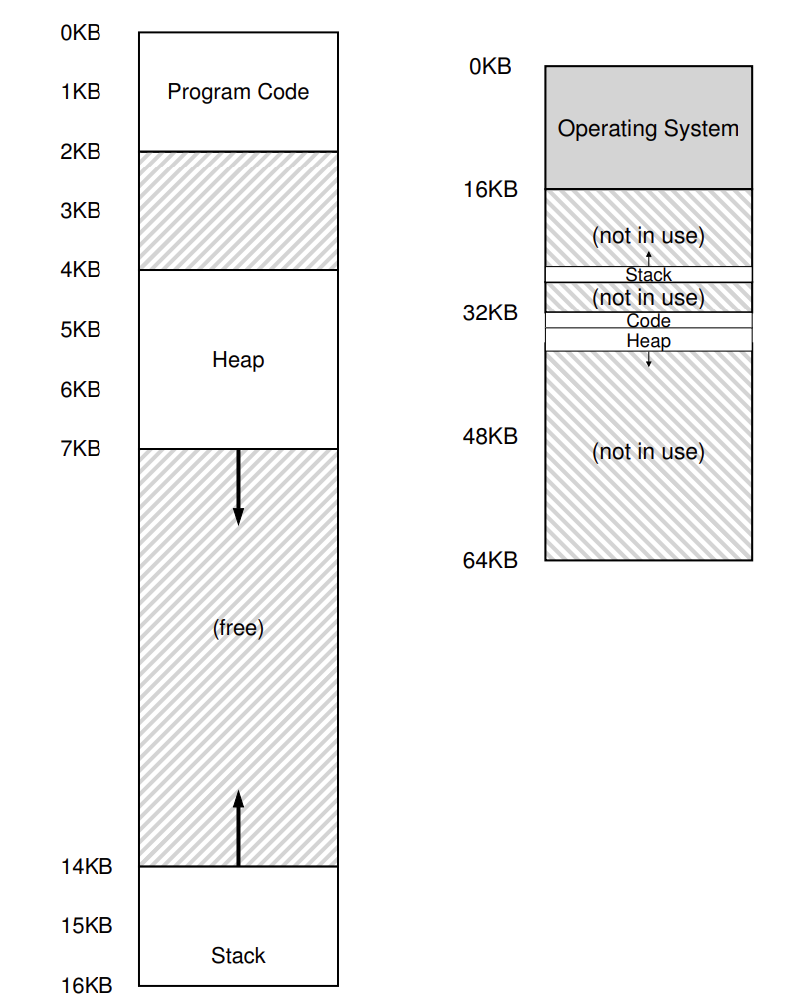
  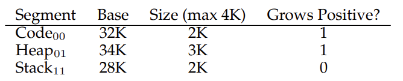
</p>

* 上图是一个例子
    * 如表中所示，代码段放在物理地址 32KB，大小为 2KB；堆在 34KB，大小也为 2KB。
    * 假设要引用代码段中的虚拟地址 100，由于 100 比 2KB 小，在界限内。因此有 `物理地址 = 100 + 32KB = 32868`。
    * 假设要引入的堆中的虚拟地址为 4200，则堆的实际偏移量为 `4200 - 4096 = 104`，，由于 104 比 2KB 小。因此有 `物理地址 = 104 + 34KB = 34920`。
    * 如果是要访问栈的话，根据增长标记为（Grows Positive），物理地址应该是减，而不是加。
    * 如果试图访问非法的地址则会产生段错误（segmentation fault）。

* 在显式方式中，使用虚拟地址的开始几位标记不同的段，用后面的位标记段内偏移量。

<p align="center">
  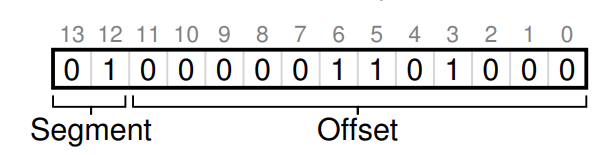
</p>

* 访问方式写成代码如下所示：
    ```c
    // 得到虚拟地址的高 2 bit
    Segment = (VirtualAddress & SEG_MASK) >> SEG_SHIFT
    // 得到段内偏移量
    Offset = VirtualAddress & OFFSET_MASK
    if (Offset >= Bounds[Segment])
        RaiseException(PROTECTION_FAULT)
    else
        PhysAddr = Base[Segment] + Offset
        Register = AccessMemory(PhysAddr)
    ```

* 问题：可能会导致外部碎片，如下图所示，当需要分配一个 20KB 的段时，当前 24KB 空闲的空间不连续，导致操作系统无法满足这个 20KB 的请求。

<p align="center">
  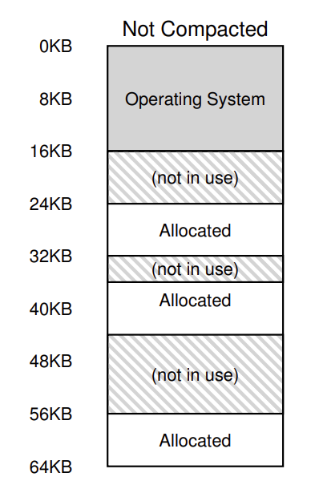
</p>

#### 空闲空间管理
* 空闲空间管理一般采用**空闲链表**的方式，空闲链表包含一组元素，记录了堆中的哪些空间还没有分配。

* 分割与合并
    * 如下所示的 30 字节的堆，对应的空闲链表会有两个元素，分别描述起始地址为 0 以及起始地址为 20 的两块空闲区域。
    * **分割**：假如申请一个字节的内存，分配程序会执行分割，它找到一块可以满足请求的空闲空间并将其分割，第一块返回给用户，第二块留在空闲列表中（addr 为 21）。
    * **合并**：如果程序调用 `free(10)` 归还堆中的空间，则这块空闲空间会首先被加入到空闲列表中，之后空闲列表将相邻的空闲空间合并为一个较大的空闲块。
<p align="center">
  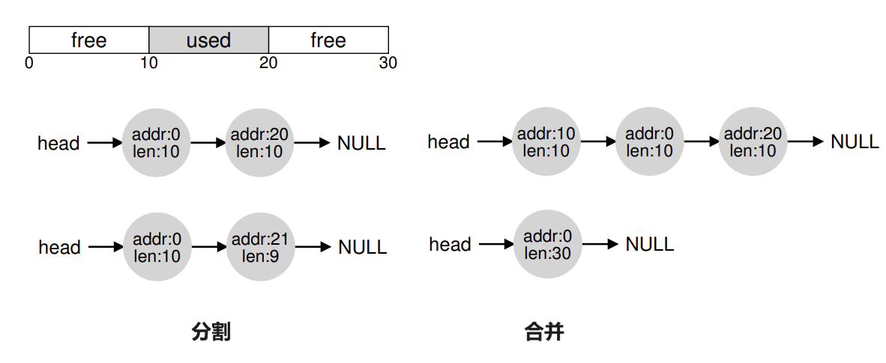
</p>

* 头块
    * `free(void *ptr)` 接口没有块大小的参数，因此它假定对于给定的指针，内存分配库可以确定要释放空间的大小，从而将它放回空闲链表。
    * 假设调用 `ptr = malloc(20)`，则一个最简单的头块中应包含所分配空间的大小以及一个 magic number 来提供完整性检查。
        ```c
        // 假设头块如下所示，为 8 字节，一个整数记录大小，一个整数记录 magic number
        typedef struct 
        {
            int size;
            int magic;
        } header_t;

        // 调用 free 时，库会通过简单的指针运算得到头块的位置
        void free(void *ptr) 
        {
            header_t *hptr = (void *) ptr - sizeof(header_t);
            ...
        }
        ```
    * 得到头块后可以用 magic number 进行校验，并通过 size 的大小计算要释放的空间大小。

<p align="center">
  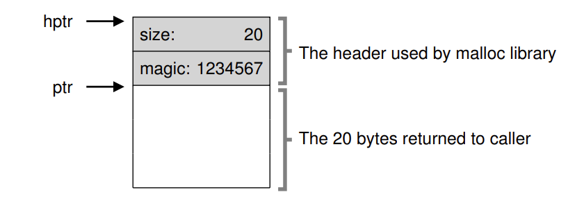
</p>

* 空闲链表操作详解
    * 初始化建表：假设需要管理一个 4KB 的内存块，空闲链表的初始化代码如下所示，`head` 指针指向这块区域的起始地址。
        ```c
        typedef struct __node_t 
        {
            int size;
            struct __node_t *next;
        } node_t;

        // mmap() 返回指向空闲空间的指针
        node_t *head = mmap(NULL, 4096, PROT_READ|PROT_WRITE,
                                        MAP_ANON|MAP_PRIVATE, -1, 0);
        // 减去 node_t 的大小
        head->size = 4096 - sizeof(node_t);
        head->next = NULL;
        ```


        <p align="center">
        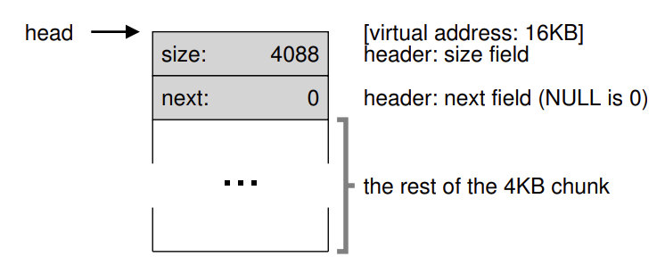
        </p>
    * 内存请求：假设有一个 100 字节的内存请求，库从原有的空闲块中分配了 108 字节（头块信息 8 字节 + 100字节），同时将列表的空闲节点缩小为 3980 字节。
    <p align="center">
    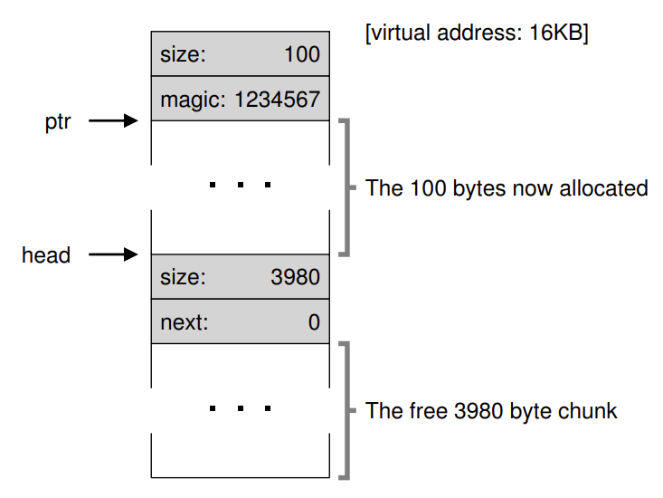
    </p>

    * 内存释放：在下面的左图中已经有 3 个被分配的内存块，假如要调用 `free(16500)` ，其中地址计算公式如下 16KB + 108 + 8 = 16500，这块内存释放后将被插入到空闲列表的头位置，如下右图所示。
    <p align="center">
    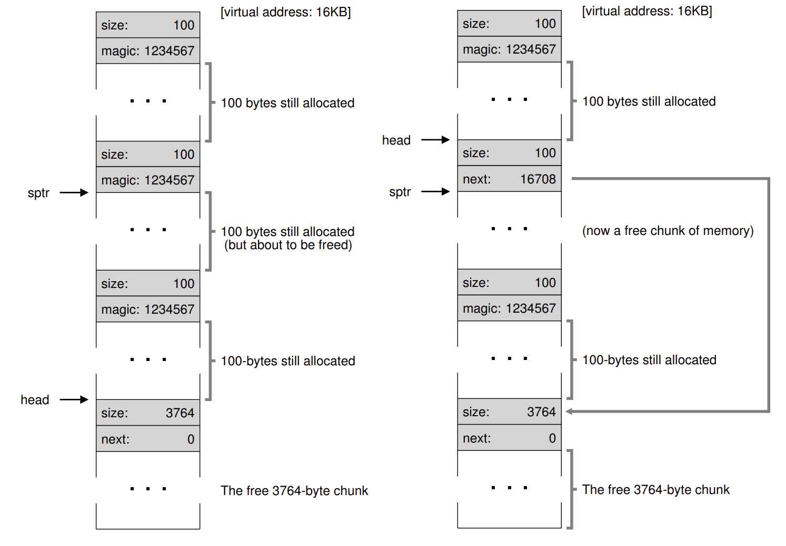
    </p>

### 分页
#### 分页的基本概念
> 分页不是将一个进程的地址空间分割成几个不同长度的逻辑段（即代码、堆、段），而是分割成固定大小的单元，每个单元称为一页，并将物理内存中的“页”称为页帧，每个页帧包含一个虚拟内存页。

<p align="center">
  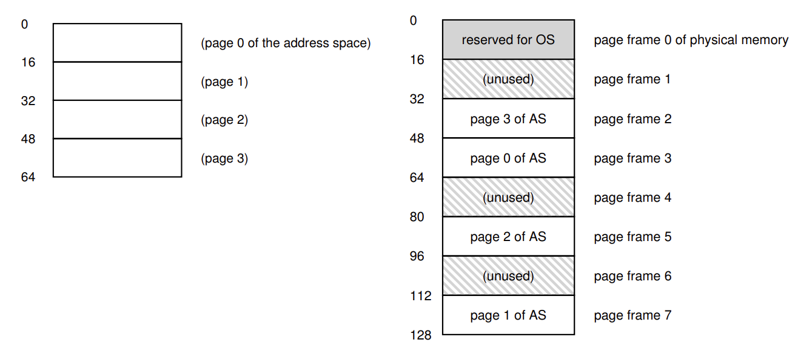
</p>

* 在上面的例子中，需要将 64 字节的小地址空间放到 8 页的物理地址空间中，操作系统找到 4 个空闲页，将虚拟页 0 放到物理页 3，虚拟页 1 放到物理页 7，虚拟页 2 放到物理页 5，虚拟页 3 放到物理页 2。
* **页表**：在每个进程中的一个数据结构，为地址空间的每个虚拟页面保存地址转换，从而让我们知道每个页在物理内存中的位置。在上面的示例中页表中应该有如下所示的 4 个条目 `VP0->PF3, VP1->PF7, VP2->PF5, VP3->PF2`。
* **地址转换**：地址转换需要依靠虚拟页面号 (virtual page number, VPN) 和页内偏移量 (offset)。
    * 上面例子中的虚拟地址空间是 64 字节，因此虚拟地址总共需要 6 位，又因为页的大小为 16 字节，因此虚拟可以划分为如下所示的形式。
    * 假如要加载虚拟地址 21，21 转换为二进制是 010101，最高两位 01，查表可得 `VP1->PF7` ，页内偏移量不变，则最终的物理地址为 1110101。
<p align="center">
  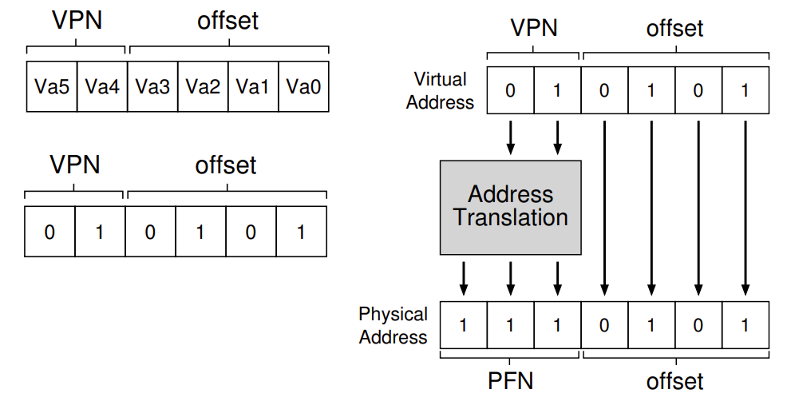
</p>
* **页表项**：操作系统会通过虚拟页号 VPN 检索页表数组，在对应索引处查找页表项 PTE，最终找到期望的物理帧号 PFN，下图是 X86 的页表项。

<p align="center">
  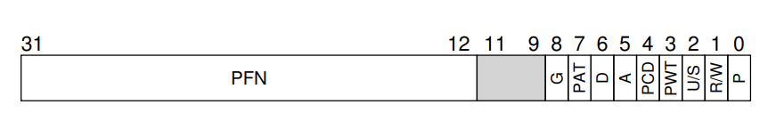
</p>

* **代码执行**：
    ```c
    // 首先通过页表基址寄存器找到想要的 PTE 的位置
    VPN = (VirtualAddress & VPN_MASK) >> SHIFT
    PTEAddr = PTBR + (VPN * sizeof(PTE))

    // 得到 PTE 的地址后硬件就可以从内存中获取 PTE
    PTE = AccessMemory(PTEAddr)
    // 检查该页是否可以访问
    if (PTE.Valid == False)
        RaiseException(SEGMENTATION_FAULT)
    else if (CanAccess(PTE.ProtectBits) == False)
        RaiseException(PROTECTION_FAULT)
    else
        // 访问物理地址
        offset = VirtualAddress & OFFSET_MASK
        PhysAddr = (PTE.PFN << PFN_SHIFT) | offset
        Register = AccessMemory(PhysAddr)
    ```
* 问题：分页都需要执行一个额外的内存访问，以便首先从页表中获取地址转换，多次的内存访问会拖慢进程的执行进度。

#### 快速地址转换 TLB
> 本质就是地址转换缓存。对每次内存访问，硬件先检查 TLB，如果其中有需要的转换映射则直接完成转换，不用访问页表。
* TLB 表项：下面是 MIPS 的 TLB 项。

    * VPN 以及 PFN 完成地址转换。
    * G：表示这个页是不是所有进程全局共享的。
    * ASID：用来区分进程空间（防止上下文切换后的对同一个物理内存的访问出现问题）。
    * D：dirty 位，用来表示该页是否被写入新数据。
    * V: valid 有效位，告诉硬件该项的地址映射是否有效。
    <p align="center">
    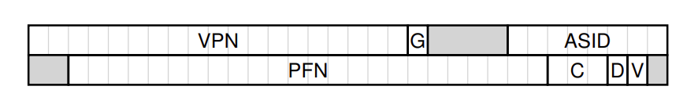
    </p>
* **基本算法**
    ```c
    // 首先从虚拟地址中提取页号 VPN
    VPN = (VirtualAddress & VPN_MASK) >> SHIFT
    // 然后检查 TLB 是否有该 VPN 的转换映射
    (Success, TlbEntry) = TLB_Lookup(VPN)
    if (Success == True) // TLB 命中
        // 直接从 TLB 中取出页帧号 PFN 并由此得到物理地址
        if (CanAccess(TlbEntry.ProtectBits) == True)
            Offset = VirtualAddress & OFFSET_MASK
            PhysAddr = (TlbEntry.PFN << SHIFT) | Offset
            Register = AccessMemory(PhysAddr)
        else
            RaiseException(PROTECTION_FAULT)
    else // TLB 未命中
        // 访存得到 PTE 用来更新 TLB
        PTEAddr = PTBR + (VPN * sizeof(PTE))
        PTE = AccessMemory(PTEAddr)
        if (PTE.Valid == False)
            RaiseException(SEGMENTATION_FAULT)
        else if (CanAccess(PTE.ProtectBits) == False)
            RaiseException(PROTECTION_FAULT)
        else
            TLB_Insert(VPN, PTE.PFN, PTE.ProtectBits)
            RetryInstruction()
    ```
* 一个例子：
    * 假设一个由 10 个 4 字节整数组成的数组 a[10]，起始虚拟地址为 100。
    * 假设有一个 8 位的地址空间，页大小为 16B，由此可以将虚拟地址划分为 4 位的 VPN（有 16 个虚拟内存页）和 4 位的 offset（每个页中 16 个字节）。
    * 考虑下面循环中对 a[i] 的内存访问，a[0] 未命中，调入 TLB，之后 a[1] 以及 a[2] 都命中；a[3] 未命中，调入 TLB，之后 a[4]、a[5] 以及 a[6] 都命中；a[7] 未命中，调入 TLB，之后 a[8] 以及 a[9] 都命中。
        ```c
        int i, sum = 0;
        for (i = 0; i < 10; i++) 
        {
            sum += a[i];
        }
        ```
<p align="center">
  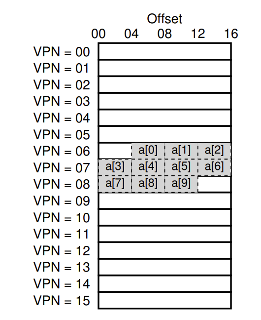
</p>

#### 多级页表
<p align="center">
  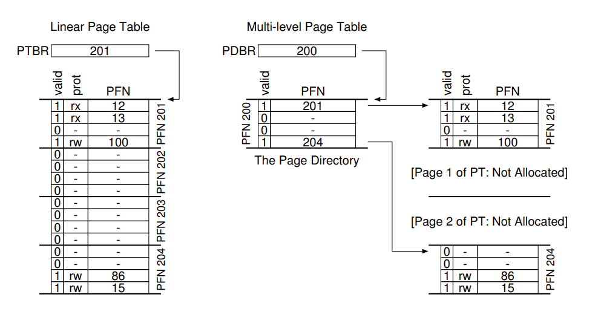
</p>

* 左图是经典的线性页表，右图是一个多级页表。多级页表由多个页目录项（Page Directory Entries，PDE）组成，PDE 中至少有 valid 位以及页帧号 PFN。当 valid 位有效时，说明该项指向的页表中至少有一页是有效的。
* 多级页表是有成本的，在 TLB 未命中时，需要从内存中加载两次，才能从页表中获取正确的地址转换信息（一次用于页目录，另一次用于 PTE 本身），而线性页表只需要一次加载。

* 地址转换过程：
<p align="center">
  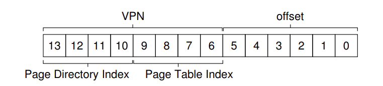
</p>

```c
// 首先从虚拟地址中提取页号 VPN
VPN = (VirtualAddress & VPN_MASK) >> SHIFT
// 然后检查 TLB 是否有该 VPN 的转换映射
(Success, TlbEntry) = TLB_Lookup(VPN)
if (Success == True) // TLB 命中
    if (CanAccess(TlbEntry.ProtectBits) == True)
        Offset = VirtualAddress & OFFSET_MASK
        PhysAddr = (TlbEntry.PFN << SHIFT) | Offset
        Register = AccessMemory(PhysAddr)
    else
        RaiseException(PROTECTION_FAULT)
else // TLB 未命中
    // 找到页表目录 PDE
    PDIndex = (VPN & PD_MASK) >> PD_SHIFT
    PDEAddr = PDBR + (PDIndex * sizeof(PDE))
    PDE = AccessMemory(PDEAddr)
    if (PDE.Valid == False)
        RaiseException(SEGMENTATION_FAULT)
    else
        // 从页表目录中找到 PTE
        PTIndex = (VPN & PT_MASK) >> PT_SHIFT
        PTEAddr = (PDE.PFN<<SHIFT) + (PTIndex*sizeof(PTE))
        PTE = AccessMemory(PTEAddr)
        if (PTE.Valid == False)
            RaiseException(SEGMENTATION_FAULT)
        else if (CanAccess(PTE.ProtectBits) == False)
            RaiseException(PROTECTION_FAULT)
        else
            TLB_Insert(VPN, PTE.PFN, PTE.ProtectBits)
            RetryInstruction()
```
## 交换空间
> 在硬盘上开辟一部分空间用于物理页的移入和移出，一般这样的空间成为交换空间（swap space），因为我们将内存中的页交换到其中，并在需要的时候又交换回去。

<p align="center">
  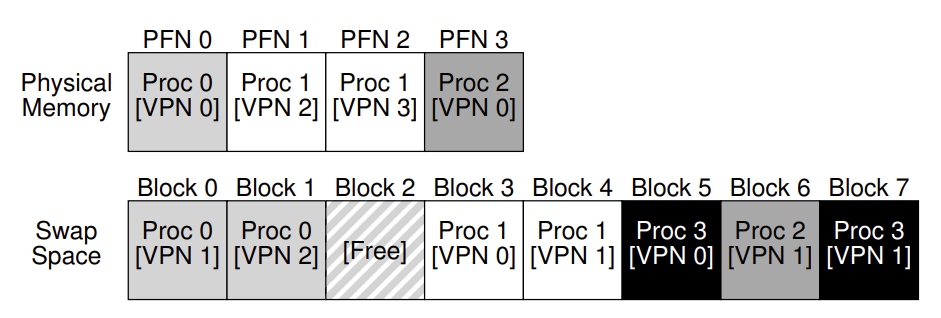
</p>

* 在上面的例子中，存在一个 4 页的物理内存和一个 8 页的交换空间。3 个进程（进程 0、进程 1、进程 2）主动共享物理内存，但是 3 个中的每一个都只有一部分有效页在内存中，剩下的在硬盘的交换空间中。进程 3 的所有页都被交换到硬盘上，因此它目前并未被运行。

* **存在位**：用于区分所访问的页在物理内存中还是在硬盘上，存在位为 1 则表示该页存在于物理内存中，否则在硬盘上。
* **页交换**：当内存满了（或者接近满了）的时候，就需要通过页交换策略先换出部分页。一般为了保证有少量的空闲空间，当操作系统发现有少于 Lw （低水位线，Low Watermark，LW）个页可以用时，后台负责内存释放的**交换守护进程**会开始运行，直到有 HW （高水位线，High Watermark，HW）个可用的页。
* **页错误**：当 TLB 未命中时，需要由操作系统的页错误处理程序处理页错误，具体处理流程如下面的代码所示。
    ```c
    /*----------基本的页处理程序------------*/
    // 首先从虚拟地址中提取页号 VPN
    VPN = (VirtualAddress & VPN_MASK) >> SHIFT
    // 然后检查 TLB 是否有该 VPN 的转换映射
    (Success, TlbEntry) = TLB_Lookup(VPN)
    if (Success == True) // TLB 命中
        if (CanAccess(TlbEntry.ProtectBits) == True)
            Offset = VirtualAddress & OFFSET_MASK
            PhysAddr = (TlbEntry.PFN << SHIFT) | Offset
            Register = AccessMemory(PhysAddr)
        else
            RaiseException(PROTECTION_FAULT)
    else // TLB 未命中
        // 找到 PTE
        PTEAddr = PTBR + (VPN * sizeof(PTE))
        PTE = AccessMemory(PTEAddr)
        if (PTE.Valid == False)
            RaiseException(SEGMENTATION_FAULT)
        else
            if (CanAccess(PTE.ProtectBits) == False)
                RaiseException(PROTECTION_FAULT)
            else if (PTE.Present == True)
                // 硬件管理 TLB
                TLB_Insert(VPN, PTE.PFN, PTE.ProtectBits)
                RetryInstruction()
            // 页错误处理
            else if (PTE.Present == False)
                RaiseException(PAGE_FAULT)

    /*----------页错误处理程序------------*/
    PFN = FindFreePhysicalPage()
    // 没找到空的页
    if (PFN == -1) 
        // 替换算法
        PFN = EvictPage()
        // 睡眠等待 I/O
        DiskRead(PTE.DiskAddr, PFN)
        // 更新页表项
        PTE.present = True
        PTE.PFN = PFN 
        RetryInstruction()
    ```

## 内存管理
* 当内存不够时，需要操作系统决定换出哪些页，为常用的页腾出空间。确定要换出的页就称之为替换策略。
* 目标：让平均内存访问时间（Average Memory Access Time，AMAT）尽量小。
$$AMAT = (P_{Hit}\times T_M) + (P_{Miss}\times T_D)$$
    * $T_M$：表示访问内存的成本。
    * $T_D$：表示访问磁盘的成本。
    * $P_{Hit}$：表示命中的概率。
    * $P_{Miss}$：表示未命中的概率。
* 假设内存访问成本为 100ns，磁盘访问成本为 10ms，则当 $P_{Hit} = 0.9$ 时平均访问时间约为 1ms，当 $P_{Hit} = 0.999$ 时，平均访问时间为 10.1 us。
* 缓存替换策略：
    * 最优替换策略（理想情况，无法实现）：替换内存中在最远将来才会被访问到的页。 
    * FIFO：页进入操作系统时被放入一个队列，当发生替换时，队首的页被换出。
    * 随机：在内存满时随机选择一个页进行替换。
    * **LRU （最少最近使用，Least-Recently-Used）**：换出最近没有被使用过的页面。在下面的例子中，第一次需要换页时，LRU 换出了页 2（0、1 的访问时间更近），之后换出页 0 （1、3 最近被访问过）。
    
    <p align="center">
    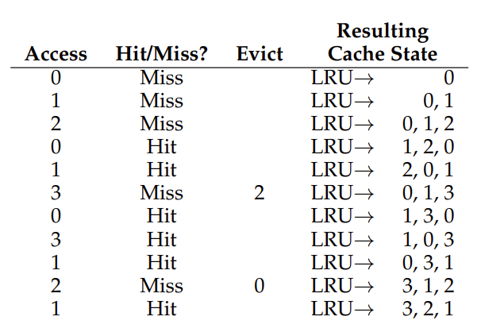
    </p>
