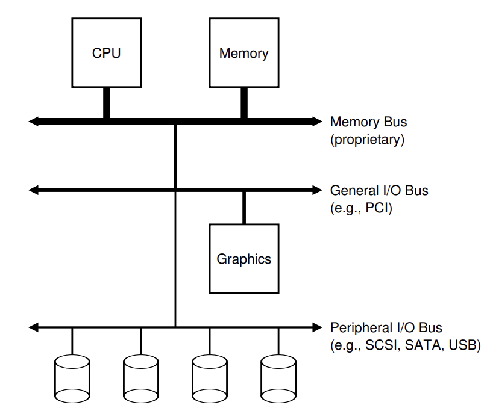
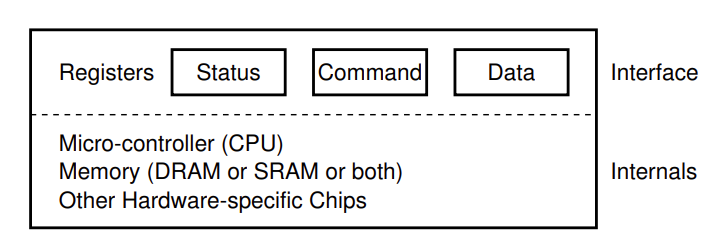
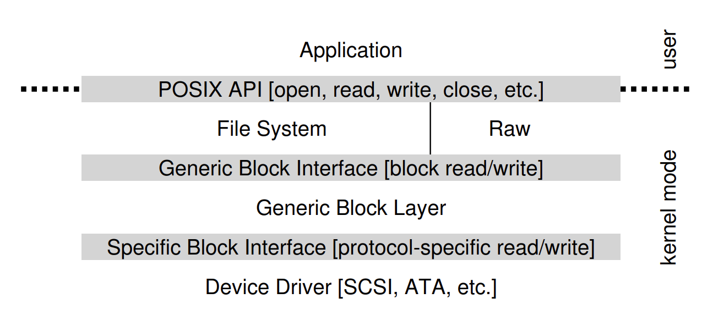

# L4 持久存储

## I/O 设备
### 系统架构
* 典型的系统架构如下所示：CPU 通过内存总线连接到系统内存，其它高性能设备通过通用总线（一般是 PCI）连接到系统，最后外围总线将低速设备连接到系统。

### 标准设备与协议
* 标准设备(并不真实存在)
    * 硬件接口（interface），简化的接口设备包含 3 个寄存器。
        * 状态寄存器（status）：可以读取并查看设备的当前状态。
        * 命令寄存器（command）：通知设备执行某个具体任务。
        * 数据寄存器 （data）：完成设备与内部结构之间的数据交互。
    * 内部结构（internals）：负责实现设备展示给系统的抽象接口。


* 标准协议：首先操作系统轮询（polling）设备，之后将数据发送到数据寄存器，再将命令写入命令寄存器，最后通过轮询等待设备执行结束。
    ```c
    While (STATUS == BUSY); // 等待设备不忙
    Write data to DATA register
    Write command to COMMAND register
        (starts the device and executes the command)
    While (STATUS == BUSY); // 等待设备完成对应的指令
    ``` 
* 中断：有中断后 CPU 向设备发送一个请求后就可以让对应进程睡眠，切换执行其他任务。当设备完成自身操作后会抛出一个硬件中断，引发 CPU 跳转执行操作系统预先定义好的中断服务例程。

### 设备驱动程序
> 通过抽象，在最底层将所有设备交互的细节都封装在设备驱动中。

* 下面以文件系统为例：文件系统完全不知道它使用的磁盘的类型，它只需要向通用块设备层发送读写请求，块设备层会将这些请求发送给对应的设备驱动，然后设备驱动完成真正的底层操作。


* IDE 磁盘驱动程序
    ```c
    static int ide_wait_ready() {
        while (((int r = inb(0x1f7)) & IDE_BSY) || !(r & IDE_DRDY)); // 等待设备不忙
    }

    // 将请求发送给磁盘
    static void ide_start_request(struct buf *b) {
        ide_wait_ready();
        outb(0x3f6, 0); // 0x3f6 是控制寄存器，这里开启中断
        outb(0x1f2, 1); // 0x1f2 是扇区计数器
        outb(0x1f3, b->sector & 0xff); // 将待访问的逻辑块地址 LBA 写入 
        outb(0x1f4, (b->sector >> 8) & 0xff); 
        outb(0x1f5, (b->sector >> 16) & 0xff); 
        outb(0x1f6, 0xe0 | ((b->dev&1)<<4) | ((b->sector>>24)&0x0f));
        if(b->flags & B_DIRTY)
        {
            outb(0x1f7, IDE_CMD_WRITE); // 0x1f7 是命令/状态寄存器，这里表示写
            outsl(0x1f0, b->data, 512/4); // 0x1f0 是数据端口，这里传输数据
        } 
        else 
        {
            outb(0x1f7, IDE_CMD_READ);  // 0x1f7 是命令/状态寄存器，这里表示读
        }
    }

    // 将请求加入队列
    void ide_rw(struct buf *b) {
        acquire(&ide_lock);
        for (struct buf **pp = &ide_queue; *pp; pp=&(*pp)->qnext); // 遍历队列
        *pp = b; // 将请求加入队尾
        if (ide_queue == b) // 如果 q 原本是空的就执行
            ide_start_request(b); // 将请求发送给磁盘
        while ((b->flags & (B_VALID|B_DIRTY)) != B_VALID)
            sleep(b, &ide_lock); // 等待磁盘处理结束
        release(&ide_lock);
    }

    // 发生中断时该函数被调用，它会从设备中读取数据（如果是读请求），并在结束后唤醒等待的进程
    void ide_intr() {
        struct buf *b;
        acquire(&ide_lock);
        if (!(b->flags & B_DIRTY) && ide_wait_ready() >= 0)
            insl(0x1f0, b->data, 512/4); // 如果是读就得到数据
        b->flags |= B_VALID;
        b->flags &= ˜B_DIRTY;
        wakeup(b); // 唤醒等待的进程
        if ((ide_queue = b->qnext) != 0) // 继续下一个请求
            ide_start_request(ide_queue);
        release(&ide_lock);
    }

    ```