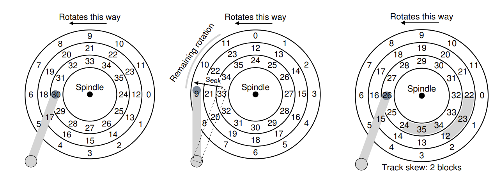
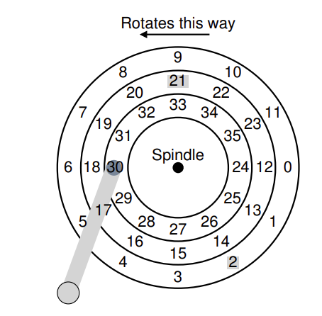
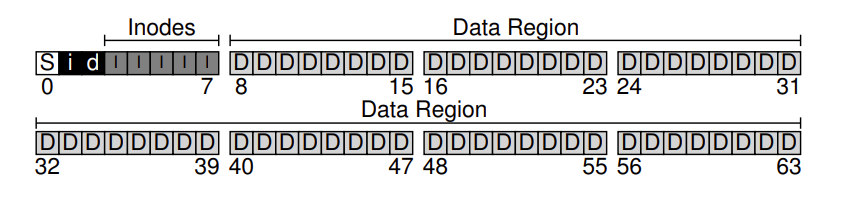

# L4 持久存储

## I/O 设备
### 系统架构
* 典型的系统架构如下所示：CPU 通过内存总线连接到系统内存，其它高性能设备通过通用总线（一般是 PCI）连接到系统，最后外围总线将低速设备连接到系统。

### 标准设备与协议
* 标准设备(并不真实存在)
    * 硬件接口（interface），简化的接口设备包含 3 个寄存器。
        * 状态寄存器（status）：可以读取并查看设备的当前状态。
        * 命令寄存器（command）：通知设备执行某个具体任务。
        * 数据寄存器 （data）：完成设备与内部结构之间的数据交互。
    * 内部结构（internals）：负责实现设备展示给系统的抽象接口。


* 标准协议：首先操作系统轮询（polling）设备，之后将数据发送到数据寄存器，再将命令写入命令寄存器，最后通过轮询等待设备执行结束。
    ```c
    While (STATUS == BUSY); // 等待设备不忙
    Write data to DATA register
    Write command to COMMAND register
        (starts the device and executes the command)
    While (STATUS == BUSY); // 等待设备完成对应的指令
    ``` 
* 中断：有中断后 CPU 向设备发送一个请求后就可以让对应进程睡眠，切换执行其他任务。当设备完成自身操作后会抛出一个硬件中断，引发 CPU 跳转执行操作系统预先定义好的中断服务例程。

### 设备驱动程序
> 通过抽象，在最底层将所有设备交互的细节都封装在设备驱动中。

* 下面以文件系统为例：文件系统完全不知道它使用的磁盘的类型，它只需要向通用块设备层发送读写请求，块设备层会将这些请求发送给对应的设备驱动，然后设备驱动完成真正的底层操作。


* IDE 磁盘驱动程序
    ```c
    static int ide_wait_ready() {
        while (((int r = inb(0x1f7)) & IDE_BSY) || !(r & IDE_DRDY)); // 等待设备不忙
    }

    // 将请求发送给磁盘
    static void ide_start_request(struct buf *b) {
        ide_wait_ready();
        outb(0x3f6, 0); // 0x3f6 是控制寄存器，这里开启中断
        outb(0x1f2, 1); // 0x1f2 是扇区计数器
        outb(0x1f3, b->sector & 0xff); // 将待访问的逻辑块地址 LBA 写入 
        outb(0x1f4, (b->sector >> 8) & 0xff); 
        outb(0x1f5, (b->sector >> 16) & 0xff); 
        outb(0x1f6, 0xe0 | ((b->dev&1)<<4) | ((b->sector>>24)&0x0f));
        if(b->flags & B_DIRTY)
        {
            outb(0x1f7, IDE_CMD_WRITE); // 0x1f7 是命令/状态寄存器，这里表示写
            outsl(0x1f0, b->data, 512/4); // 0x1f0 是数据端口，这里传输数据
        } 
        else 
        {
            outb(0x1f7, IDE_CMD_READ);  // 0x1f7 是命令/状态寄存器，这里表示读
        }
    }

    // 将请求加入队列
    void ide_rw(struct buf *b) {
        acquire(&ide_lock);
        for (struct buf **pp = &ide_queue; *pp; pp=&(*pp)->qnext); // 遍历队列
        *pp = b; // 将请求加入队尾
        if (ide_queue == b) // 如果 q 原本是空的就执行
            ide_start_request(b); // 将请求发送给磁盘
        while ((b->flags & (B_VALID|B_DIRTY)) != B_VALID)
            sleep(b, &ide_lock); // 等待磁盘处理结束
        release(&ide_lock);
    }

    // 发生中断时该函数被调用，它会从设备中读取数据（如果是读请求），并在结束后唤醒等待的进程
    void ide_intr() {
        struct buf *b;
        acquire(&ide_lock);
        if (!(b->flags & B_DIRTY) && ide_wait_ready() >= 0)
            insl(0x1f0, b->data, 512/4); // 如果是读就得到数据
        b->flags |= B_VALID;
        b->flags &= ˜B_DIRTY;
        wakeup(b); // 唤醒等待的进程
        if ((ide_queue = b->qnext) != 0) // 继续下一个请求
            ide_start_request(ide_queue);
        release(&ide_lock);
    }

    ```

## 磁盘驱动器
### 基本概念
* 接口：现代磁盘驱动器的接口都比较简单，可以将磁盘视为一组扇区，每个扇区都可以读取或写入，0 到 n-1 表示驱动器的地址空间。



* 在上面的图中磁盘最外侧的磁道有 12 个扇区，每个扇区的大小为 512 字节，用 0 到 11 的数字表示，总共有三个磁道。单个盘片围绕主轴旋转，电机连接到主轴。
* I/O 时间：是下面三个主要的时间的和
$$ T_{I/O} = T_{寻道} + T_{旋转} + T_{传输}$$
    * 旋转延迟：磁盘要等待期望的扇区旋转到磁头下才可以读取数据，这个等待的时间就是旋转延迟。
    * 寻道时间：当所要读取的数据与磁头在不同的磁道时，驱动器必须首先将磁盘臂移动到正确的磁道，这个移动的时间就是寻道时间。
    * 传输时间：从磁头读取数据的时间。

### 磁盘调度
* 最短寻道时间优先（SSTF）
    * 按照磁盘访问请求队列排序，选择最近磁道上的请求先完成。例如在下面的例子中，我们同时请求扇区 21 （中间磁道）以及扇区 2（外圈磁道），那么我们会首先发出对 21 的请求，之后再发出对 2 的请求。
    * 问题：容易发生饥饿。


* 电梯（SCAN）
    * 以跨域磁盘的顺序来服务磁盘请求，如果请求的块所属的磁道在跨越一遍磁盘的过程中已经服务过了，它就不会立即处理，而是排队等待下一次扫描。
    * 问题：忽视了旋转过程中可能一开始离得比较近的 sector。

* 最短定位时间优先（SPTF）
    * 磁盘内部根据访问时间的长短进行规划。例如如果寻道时间远高于旋转延迟，那就采用 SSTF。

### 文件和目录
> 虚拟存储有两个关键的抽象。一个是文件（file），文件就是一个线性字节数组，每个字节都可以读取或写入。另一个是目录（directory），是对文件以及其它目录的一种组织架构。

#### 文件管理 API
* 创建文件 `open`
    * 创建文件可以接受一些不同的标志，在下面的例子中程序创建文件 `O_CREAT`，以 `O_WRONLY` 这种方式打开表示只能写入该文件，并且如果该文件已经存在，则首先将其截断为零字节大小，删除现有的内容 `O_TRUNC`。
    * `open` 会返回一个文件描述符。文件描述符只是一个整数，是每个进程私有的，在 UNIX 系统中用于访问文件。
    * `int fd = open("foo", O_CREAT | O_WRONLY | O_TRUNC);`
* 读写文件
    * 使用 `read` 以及 `write`，下面给出一个示例
        ```c
        ubuntu:~$ echo hello > foo
        ubuntu:~$ cat foo
        // 使用 strace 追踪 cat 的调用过程
        ubuntu:~$ strace cat foo

        open("foo", O_RDONLY|O_LARGEFILE) = 3
        // cat 使用 `read` 系统调用重复读取文件中的一些字节
        read(3, "hello\n", 4096) = 6
        // 将结果输出到标准输出（屏幕）
        write(1, "hello\n", 6) = 6
        hello
        // 多次调用完成读取后关闭文件
        read(3, "", 4096) = 0
        close(3) = 0
        ```
    * `lseek`：实现从文件中的某些随机偏移量中读取数据。
    * `fsync(int fd)`：当进程调用该接口时，文件系统将指定文件描述符对应的所有尚未写入磁盘的数据写入磁盘。当调用 `write` 时，它只是告诉文件系统在将来的某个时刻将此数据写入磁盘，出于性能的考虑，文件系统会将这些写入到内存中缓冲一段时间再写到磁盘中，因此就有了 `fsync` 这个需求。
* 文件重命名：本质是使用系统调用 `rename(char* old, char* new)`。
    ```c
    ubuntu:~$ mv foo bar
    // 下面是使用 strace 追踪的结果
    // 将文件的新版本写入临时名称
    int fd = open("foo.txt.tmp", O_WRONLY|O_CREAT|O_TRUNC,S_IRUSR|S_IWUSR);
    write(fd, buffer, size); // 写入新版本文件
    // 使用 fsync 将其强制写入磁盘
    fsync(fd);
    close(fd);
    // 将临时文件重命名为原有文件的名称
    rename("foo.txt.tmp", "foo.txt");

    ```
* 获取文件信息：使用 `stat` 系统调用。
* 删除文件：在文件删除中调用的是 `unlink` 实际上就是在减少引用计数，当计数到零时才真正删除这个文件。

    ```c
    ubuntu:~$ strace rm foo
    ...
    unlink("foo") = 0
    ...

    ```
#### 目录管理 API
* 创建目录：使用系统调用 `mkdir`。
    ```c
    ubuntu:~$ strace mkdir foo
    ...
    mkdir("foo", 0777) = 0
    ...
    ```
* 读取目录：使用 `opendir` 、 `readdir` 以及 `closedir` 完成这个工作。
* 删除目录：使用 `rmdir`。

#### 文件链接 API
* 硬链接：当用一个新的文件名链接到一个旧的文件名时，本质上是建立了对同一个文件的引用。查看两者的 inode 可以发现两者的 inode 编号是相同的，因此本质就是引用。
    ```c
    ubuntu:~$ ls -i file file2
    67158084 file
    67158084 file2
    ```
* 符号链接（软连接）：可以通过软链接符号名称来访问原始文件，但是软链接本质上是一个不同类型的文件。
    ```c
    ubuntu:~$ echo hello > file
    ubuntu:~$ ln -s file file2
    ubuntu:~$ cat file2
    hello
    ```
#### 创建并挂载文件系统 API
* 调用 `mount` 实现，例如有一个未挂载的 `ext3` 文件系统，存储在设备分区 `/dev/sda1` 中，包含一个根目录，其中包含两个子目录 a 与 b。
    ```c
    ubuntu:~$ mount -t ext3 /dev/sda1 /home/users
    ubuntu:~$ ls /home/users/
    a b
    ```

### 文件系统的实现
* 以 UNIX 文件系统的简化版本 VSFS (Very Simple File System) 为例。
#### 整体组织
* 首先对磁盘进行分块，假设每个块大小为 4KB，这里的小磁盘仅有 64 块。
    * 数据区域（Data Region）：用来存放用户数据，假设是小磁盘的最后 56 个块。
    * inode 区域：文件系统使用 inode 结构来存储每个文件的信息，记录文件包含哪些数据块、文件的大小、其所有者和访问权限、访问和修改时间以及其余类似的信息，假设小磁盘上有 5 块存放 inode，假设每个 inode 为 256 字节，则一个 4KB 的块可以容纳 16 个 inode，下面的文件系统总共包含 80 个 inode。
    * 位图（bitmap）：需要某种方法来记录 inode 或数据块是空闲还是已分配，简单的方式是使用 inode 位图（i）以及数据位图（d）来记录，其中每个位用于指示相应的对象是空闲（0）还是正在使用（1）。
    * 超级块（superblock）：包含关于该特定文件系统的信息，包括文件系统中有多少个 inode 和数据块（在这个例子中为 80 和 56）、inode 表开始位置（块 3）、用来识别文件系统类型的 magic number 等。
> 在挂载文件系统时，操作系统首先读取超级块，初始化各种参数，然后将该卷加入到文件系统树中。

